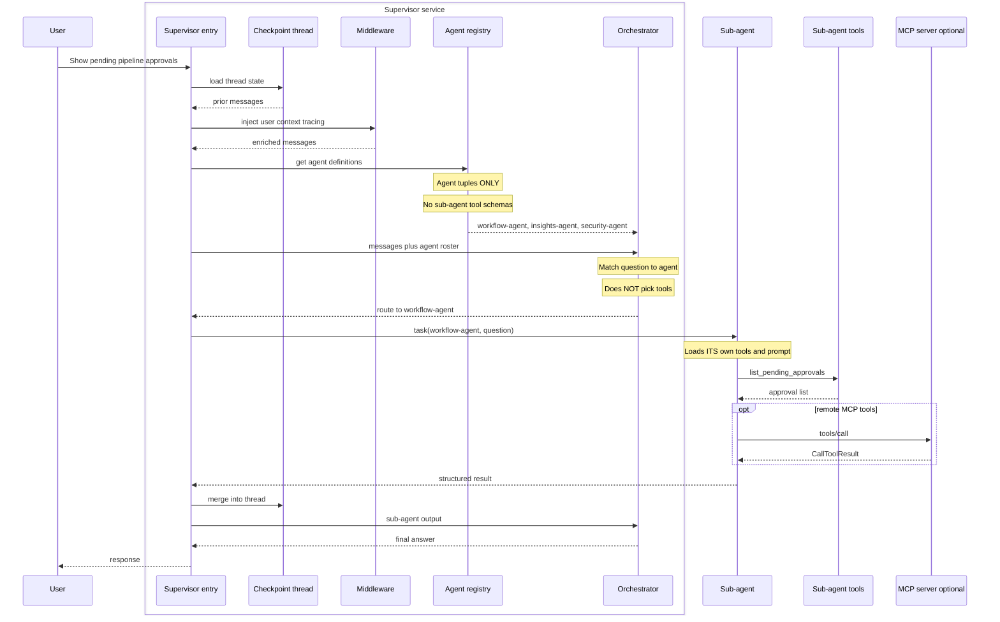
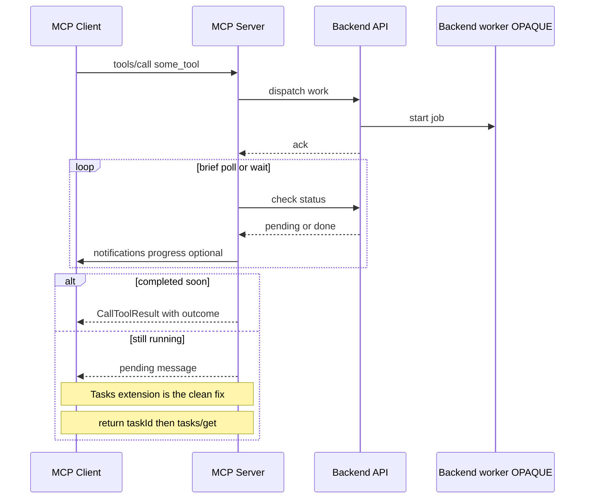

# Deep Agent Architecture vs MCP Agents

> Compare how **deep-agent** systems build effective multi-agent orchestration with what
> **MCP Agents** offers today — and one concrete improvement: **agent definition**.

---

## 1. What this compares

**Deep-agent architecture** (supervisor + registered sub-agents + nested specialists) builds
effective agents: bounded context, clear routing, scoped tools.

**MCP Agents** is strong at remote tools and Tasks, but does not yet expose a **delegation /
agent-definition** layer on the wire.

This document:

1. Describes the deep-agent shape ([LangChain Deep Agents](https://docs.langchain.com/oss/python/deepagents/subagents) as the framework model)
2. Contrasts it with a typical MCP **server / tools** sequence
3. Proposes **one ask for now: agent definition** — so hosts can route like deep agents without adopting a specific runtime

Other Agents WG approaches exist ([PR #5](https://github.com/modelcontextprotocol/agents-wg/pull/5)). This doc uses the **supervisor–subagent tree** as the reference stress test.

---


## 2. Why deep agents scale better

Effective multi-domain agents converge on **orchestrator + registered sub-agents** — not every
tool on one agent.


| Pattern                            | Role                                                  |
| ---------------------------------- | ----------------------------------------------------- |
| MCP / toolsets alone               | Flat `tools/list` grows costly for supervisors        |
| Single agent + many tools          | Breaks when schema count and wrong picks explode      |
| Graph orchestration                | Threads and routing stay in the app                   |
| **Supervisor + subagent registry** | Match a specialist; tools stay behind that specialist |


Same idea across the ecosystem:

- [LangChain Deep Agents](https://docs.langchain.com/oss/python/deepagents/subagents) — `subagents=` + `task()`
- [Claude Code–style setups](https://towardsdatascience.com/claude-skills-and-subagents-escaping-the-prompt-engineering-hamster-wheel/) — main agent only knows specialists
- [Vercel AI SDK subagents](https://ai-sdk.dev/docs/agents/subagents) — parent delegates; child has own context
- Skills ([Agent Skills](https://agentskills.io/)) — progressive *know-how*; pairs with subagents, does not replace them

Skills = **how**. Subagents = **who**. This doc focuses on **who**.

---


## 3. What “Deep Agents” means here

[Deep Agents](https://docs.langchain.com/oss/python/deepagents/customization) (`create_deep_agent`)
is a LangGraph harness with middleware, optional skills/memory, and **subagents**.


| Concept              | Role                                                                                      |
| -------------------- | ----------------------------------------------------------------------------------------- |
| **Supervisor**       | Sees subagent **names + descriptions**; calls `task` to delegate                          |
| **SubAgent**         | `name`, `description`, `system_prompt`, optional `tools`, `model`, `middleware`, `skills` |
| **CompiledSubAgent** | Pre-built graph exposed via the same `task` tool                                          |
| **AsyncSubAgent**    | Remote/background worker                                                                  |
| **Nesting**          | A subagent can own further subagents — tree depth grows with the domain                   |


---


## 4. Inside a deep-agent system

What MCP Agents should eventually **help solve** — not re-implement as LangGraph-on-the-wire.

### Objects

```text
Thread (conversation / checkpoint id)
  └── Supervisor deep agent
        ├── Agent registry entries (tuples)
        │     name, description, capabilities / examples
        │     (tools stay OFF this list)
        ├── Middleware stack
        ├── Own generic tools (optional)
        └── task(name, input) → Sub-agent
              ├── Own model + system prompt
              ├── Own tool schemas
              ├── Own middleware
              └── Optional: further sub-agents (tree)
                    └── Optional: MCP servers as leaf tools
```


### How agents get registered

```text
1. Domain team defines SubAgent config
   (name, description, tools, prompt, model, middleware)
2. Registry collects configs at startup (or reload)
3. Supervisor is created with subagents=[...]
4. Runtime: supervisor prompt includes roster of name+description only
5. User turn → match agent → task(agent, question) → subagent picks tools
```

```python
# Pseudocode — Deep Agents style
create_deep_agent(
    name="supervisor",
    tools=generic_tools,
    subagents=[
        {
            "name": "workflow-agent",
            "description": "Pipelines, approvals, run history, connectors",
            "system_prompt": "...",
            "tools": workflow_tools,   # NOT visible to supervisor
            "model": "...",
            "middleware": [...],
        },
        # ...
    ],
    middleware=[...],
    checkpointer=...,
)
```


### What middleware is for


| Concern        | Role                                                 |
| -------------- | ---------------------------------------------------- |
| **Routing**    | Roster in prompt; NL match to `name` / `description` |
| **Context**    | User/org profile; thread history from checkpoint     |
| **Tracing**    | Per-agent spans for wrong routes and tool picks      |
| **Model tier** | Fast model for easy turns; larger for hard ones      |
| **Latency**    | Small supervisor context (agents, not 70 tools)      |
| **RAG / data** | Retrieval behind the subagent, not the supervisor    |


**Checkpoint / thread** = conversation memory (app state).  
**MCP Task** = async handle for one remote job. Different things.

### One turn, end to end




---


## 5. Typical MCP server sequence

What hosts actually talk to in production: an **MCP server** exposing tools — not a first-class
agent roster. Sometimes the tool implementation wraps a remote/opaque worker (see
[mcp-agent-tools.md](./mcp-agent-tools.md)); that worker is behind `tools/call`.




**Works well:** standard remote invoke; Tasks cleans up long polls.  

---


## 6. Deep agent vs MCP


| Capability                                    | Deep-agent system           | MCP today                         |
| --------------------------------------------- | --------------------------- | --------------------------------- |
| Named specialist roster                       | Agent registry              | Flat `tools/list`                 |
| Delegate by NL match to agent                 | `task(agent, input)`        | No standard primitive             |
| Bounded tools per specialist                  | Tools only on that subagent | All tools if listed on one server |
| Nested specialists                            | Subagent owns subagents     | Not modeled                       |
| Conversation memory                           | Checkpoint / thread         | App-owned                         |
| Middleware (routing, model tier, RAG, traces) | App stack                   | Out of scope                      |
| Remote leaf tools                             | Subagent may call MCP       | ✅ `tools/call`                    |
| Long remote jobs                              | App + optional Tasks        | ✅ Tasks                           |
| Workflow / how-to docs                        | Prompts; optional Skills    | 🧪 Skills                         |
| Rich UI                                       | App or MCP Apps             | ✅ MCP Apps                        |
| Opaque remote agent-as-tool                   | Optional                    | ✅ Approach 1                      |


---


## 7. Ask 1:  Agent definition


Deep agents scale because the supervisor sees an **agent registry**, not every tool:

```text
BAD (flat tools as discovery):
  Orchestrator sees 70 tool schemas → picks the tool itself → sprawl, mis-routes

GOOD (agent definition / registry):
  Orchestrator sees 3 agent tuples → routes to workflow-agent → that agent picks the tool
```

That registry:

1. Lets the supervisor understand **capabilities** without tool sprawl  
2. Makes routing question → **agent**, not question → one of 70 tools  
3. **Scopes** each turn to one specialist’s tools and prompt  
4. Lets the tree **grow** (add an agent = a few roster lines, not dozens of schemas)

Skills ≠ delegation roster. Tasks ≠ named specialists.

### What we want from MCP

A portable way to advertise **delegatable agents**, so hosts can route like deep agents —
without putting LangGraph, checkpoints, or middleware on the wire.


### Discovery payload

```jsonc
{
  "agents": [
    {
      "agentId": "workflow-agent",
      "description": "Pipelines, automation tasks, approval gates, run history, connectors",
      "capabilities": [
        "Pipeline catalog and execution",
        "Approval gates: list, approve, reject",
        "Run history and run analysis"
      ],
      "exampleTasks": [
        "Show pending pipeline approvals",
        "Why did pipeline X fail on its latest run?"
      ],
      "delegateTool": "invoke_workflow_agent",
      "tasksEnabled": true,
      "skillUri": "skill://workflow-agent/SKILL.md"
    }
  ]
}
```

### Invoke after route

```jsonc
{
  "method": "tools/call",
  "params": {
    "name": "invoke_workflow_agent",
    "arguments": { "query": "Show pending pipeline approvals" }
  }
}
```

### Wire shape (open for debate)

| Option | Idea |
|--------|------|
| A | `agents/list` (+ optional `agents/get`) |
| B | Resources under `agent://…` |
| C | Extension `io.modelcontextprotocol/agents` on discover / settings |

Semantic ask is fixed: **agent tuples for routing; tools stay behind the delegate.**

---

## 8. FAQ


### Why can’t tools just be subagents?

Tools can belong to any specialist. If the supervisor sees all of them, it pays ~70 schemas and
mis-picks. Subagents are **who first, then which tool**.

### Why not host each subagent as a remote MCP server?

That is Approach 1. Fine for opaque remote agents, but:

- Extra hop and latency every turn  
- Heavy ops (host, version, auth many servers)  
- Still no **shared registry** unless every client filters inventively

MCP under a subagent is great. MCP **instead of** a registry is a weak substitute.

---


## References

- [PR #20](https://github.com/modelcontextprotocol/agents-wg/pull/20)
- [Approaches PR #5](https://github.com/modelcontextprotocol/agents-wg/pull/5)
- [mcp-agent-tools.md](./mcp-agent-tools.md)
- [Deep Agents customization](https://docs.langchain.com/oss/python/deepagents/customization)
- [Deep Agents subagents](https://docs.langchain.com/oss/python/deepagents/subagents)
- `[create_deep_agent](https://reference.langchain.com/python/deepagents/graph/create_deep_agent)`
- [SEP-2663 Tasks](https://modelcontextprotocol.io/seps/2663-tasks-extension)
- [AI SDK subagents](https://ai-sdk.dev/docs/agents/subagents)
- [2026-04-21 meeting](https://github.com/modelcontextprotocol/agents-wg/blob/main/meetings/2026-04-21.md)
- [2026-05-29 meeting](https://github.com/modelcontextprotocol/agents-wg/blob/main/meetings/2026-05-29.md)

