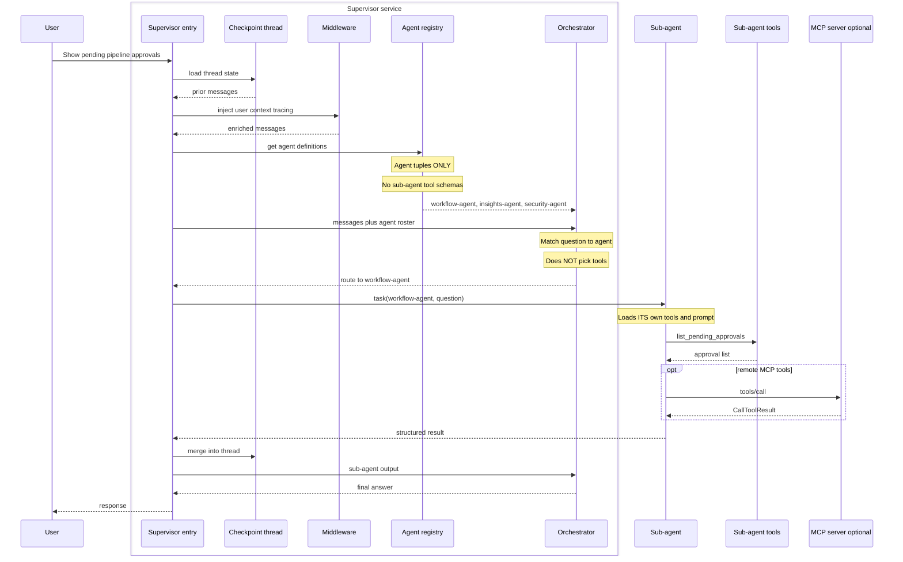
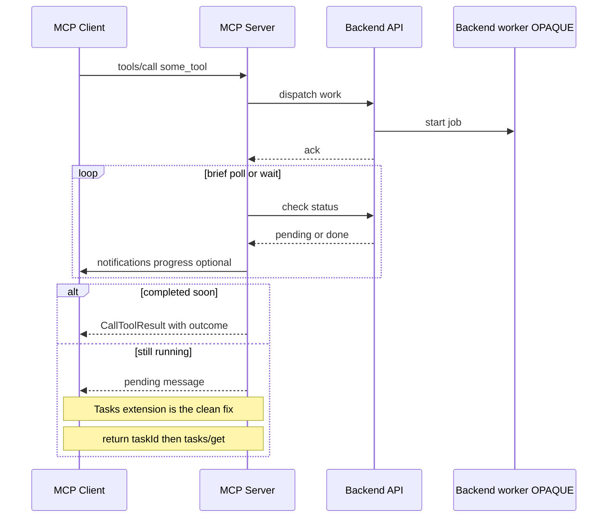

# Deep Agent Architecture vs MCP Agents

> Compare how **deep-agent** systems build effective multi-agent orchestration with what
> **MCP Agents** offers today — and one concrete improvement: **agent definition**.

---

## 1. What this compares

**Deep-agent architecture** (supervisor + registered sub-agents + nested specialists) builds
effective agents: bounded context, clear routing, scoped tools.

**MCP Agents** is strong at remote tools and Tasks, but does not yet expose a **delegation /
agent-definition** layer on the wire.

This document:

1. Introduces **Deep Agents** ([docs](https://docs.langchain.com/oss/python/deepagents/subagents)) — lineage from LangChain / LangGraph, capabilities, skills, and how tools/subagents attach
2. Contrasts that shape with a typical MCP **server / tools** sequence
3. Proposes **one ask for now: agent definition** — so hosts can route like deep agents without adopting a specific runtime

Other Agents WG approaches exist ([PR #5](https://github.com/modelcontextprotocol/agents-wg/pull/5)). This doc uses the **supervisor–subagent tree** as the reference stress test.

---

## 2. Deep Agents primer — lineage, capabilities, skills, registration

[Deep Agents](https://docs.langchain.com/oss/python/deepagents/overview) (`deepagents`) is an
**agent harness** built on LangChain primitives and the LangGraph runtime: planning, filesystem
context, skills, memory, subagents, and human-in-the-loop come packaged via
[`create_deep_agent`](https://reference.langchain.com/python/deepagents/graph/create_deep_agent).
MCP fits naturally as a **leaf tool** source under a specialist. The WG ask later is a portable
**agent definition** so hosts can route the same way without shipping that harness on the wire.

### 2.1 Lineage: LangChain → LangGraph → Deep Agents

| Layer | Optimized for | Mental model |
| ----- | ------------- | ------------ |
| **[LangChain](https://docs.langchain.com/)** | Composing LLM calls with tools, prompts, retrievers | **Chains** — prompt → model → tool → parse. Strong for linear flows; awkward once control flow, retries, and branching dominate |
| **[LangGraph](https://docs.langchain.com/oss/python/langgraph/overview)** | Stateful multi-actor apps | **Graphs** — nodes, edges, checkpoints; orchestration, cycles, interrupt/resume, thread memory, streaming |
| **Deep Agents** | Production agent harness on those blocks | **Deeper SDK** — same tool-calling loop, plus planning, files, skills, memory, subagents, HITL |

```text
LangChain          LangGraph              Deep Agents
─────────          ─────────              ───────────
tool / chain       graph runtime          agent harness
compose steps      orchestrate + memory   plan · files · skills · subagents · HITL
                   checkpoint / stream    create_deep_agent(...)
```

- **LangChain** — primitives: chat models, `@tool` / `StructuredTool`, LCEL, `create_agent`
- **LangGraph** — durable runtime: state graphs, checkpointers, interrupts, streaming
- **Deep Agents** — batteries-included harness: pass model, `tools`, optional `subagents` /
  `skills` / `memory` / middleware; get `write_todos`, virtual filesystem, progressive skills,
  and a built-in `task` tool for delegation

You can also stay on `create_agent` + LangGraph alone (our POC does, for lean Groq-friendly
routing) when you want the routing pattern without the full harness surface.

### 2.2 What Deep Agents supports

| Area | Built-in support |
| ---- | ---------------- |
| **Execution** | Custom / MCP tools; virtual filesystem (`ls`, `read_file`, `write_file`, `edit_file`, `glob`, `grep`, …); optional sandbox `execute`; interpreters |
| **Context** | Skills (`SKILL.md`); memory (`AGENTS.md`); summarization / context offloading; prompt caching where supported |
| **Delegation** | `write_todos` for planning; `task` for subagents (general-purpose or custom) with isolated context |
| **Steering** | HITL via `interrupt_on` (pause before sensitive tool calls) |
| **Durability** | LangGraph checkpointer / store — threads, resume, long runs |
| **Customization** | `system_prompt`, `middleware`, `backend`, `permissions`, `response_format`, harness profiles |

| Concept | Role |
| ------- | ---- |
| **Supervisor** | Sees subagent **names + descriptions**; delegates via `task` |
| **SubAgent** | `name`, `description`, `system_prompt`, optional `tools`, `model`, `middleware`, `skills` |
| **CompiledSubAgent** | Pre-built graph exposed through the same `task` tool |
| **AsyncSubAgent** | Remote / background worker |
| **Nesting** | A subagent can own further subagents |

### 2.3 What is `SKILL.md`?

A **skill** is a directory with a `SKILL.md` ([Agent Skills](https://agentskills.io/) standard)
plus optional `scripts/`, `references/`, `assets/`. It holds reusable how-to knowledge —
workflows, conventions, templates — without stuffing every procedure into the system prompt.

```md
---
name: release-readiness
description: Use when assessing go/hold for a service release — pipelines, CVEs, risk.
---

# Release readiness

## Instructions
1. Gather failed pipelines and pending approvals for the named service.
2. Check recent outages / CVEs for that domain.
3. Produce a short go/hold with evidence.
```

**Progressive disclosure:**

| Level | Loads | When |
| ----- | ----- | ---- |
| 1. Metadata | `name` + `description` from frontmatter | Startup (compact) |
| 2. Instructions | Full `SKILL.md` body | When the agent selects the skill |
| 3. Resources | Files under the skill dir | As instructions reference them |

```python
agent = create_deep_agent(
    model="anthropic:claude-sonnet-4-6",
    backend=FilesystemBackend(root_dir="./my-project"),
    skills=["./my-project/skills/"],   # dirs containing */SKILL.md
    tools=[...],
)
```

Skills are **how** (on-demand know-how). Subagents are **who** (specialists you delegate to).
A specialist can carry its own `skills=` paths. Separately, **memory** (`AGENTS.md` via
`memory=`) is always-on preferences; skills stay on-demand.

### 2.4 How tools and subagents attach

Nothing is auto-discovered from arbitrary modules. You pass callables, LangChain tools, or
MCP-backed tools into `create_deep_agent`, and specialists via `subagents=`.

**Domain tools → `tools=`** (merged with harness built-ins such as `write_todos`, filesystem,
`task`):

```python
@tool
def list_pending_approvals(service: str) -> str:
    """List pending pipeline approvals for a service."""
    ...

agent = create_deep_agent(
    model="...",
    tools=[list_pending_approvals, ...],
    system_prompt="...",
)
```

To hide built-ins, use a harness profile / `excluded_tools` (see Deep Agents docs).

**Specialists → `subagents=`** (their tool schemas never appear on the supervisor):

```python
create_deep_agent(
    name="supervisor",
    subagents=[
        {
            "name": "workflow-agent",
            "description": "Pipelines, approvals, run history, connectors",
            "system_prompt": "...",
            "tools": workflow_tools,
            "skills": ["./skills/workflow/"],  # optional
        },
    ],
    skills=["./skills/shared/"],
    checkpointer=...,
)
```

Runtime: supervisor gets a **roster** (`name` + `description`) → calls
`task(subagent_type, description)` → specialist runs with its own prompt, tools, and optional
skills → returns a compact result.

Apps often wrap the same shape in a registry (`register_agent(...)` at import, then
`subagents=get_all_agent_configs()`), or hand-roll a lean `task` tool on `create_agent` as in
our POC.

| Surface | Supervisor | Specialist |
| ------- | ---------- | ---------- |
| Agent tuple (`name`, `description`, …) | Yes | — |
| Tool schemas | No | Own tools only |
| Skill metadata | Names / descriptions | Full body when invoked |

Similar Subagent ecosystem:

- [LangChain Deep Agents](https://docs.langchain.com/oss/python/deepagents/subagents) — `subagents=` + `task()`
- [Claude Code–style setups](https://towardsdatascience.com/claude-skills-and-subagents-escaping-the-prompt-engineering-hamster-wheel/) — main agent only knows specialists
- [Vercel AI SDK subagents](https://ai-sdk.dev/docs/agents/subagents) — parent delegates; child has own context


---

## 3. Inside a deep-agent system

Shape that MCP Agents would help **advertise**, not re-host as a full graph runtime.

### Objects

```text
Thread (conversation / checkpoint id)
  └── Supervisor deep agent
        ├── Agent registry entries (tuples)
        │     name, description, capabilities / examples
        │     (tools stay OFF this list)
        ├── Middleware stack
        ├── Own generic tools (optional)
        └── task(name, input) → Sub-agent
              ├── Own model + system prompt
              ├── Own tool schemas
              ├── Own middleware
              └── Optional: further sub-agents (tree)
                    └── Optional: MCP servers as leaf tools
```

### Middleware

| Concern | Role |
| ------- | ---- |
| **Routing** | Roster in prompt; NL match to `name` / `description` |
| **Context** | User/org profile; thread history from checkpoint |
| **Tracing** | Per-agent spans for wrong routes and tool picks |
| **Model tier** | Fast model for easy turns; larger for hard ones |
| **Latency** | Small supervisor context (agents, not 70 tools) |
| **RAG / data** | Retrieval behind the subagent, not the supervisor |

**Checkpoint / thread** = conversation memory (app state).  
**MCP Task** = async handle for one remote job. Different things.

### One turn, end to end



---

## 4. Typical MCP server sequence

What hosts talk to in production: an **MCP server** exposing tools — not a first-class agent
roster. Sometimes the tool wraps a remote/opaque worker (see
[mcp-agent-tools.md](./mcp-agent-tools.md)); that worker stays behind `tools/call`.



**Works well:** standard remote invoke; Tasks cleans up long polls.

---

## 5. Deep agent vs MCP

| Capability | Deep-agent system | MCP today |
| ---------- | ----------------- | --------- |
| Named specialist roster | Agent registry | Flat `tools/list` |
| Delegate by NL match to agent | `task(agent, input)` | No standard primitive |
| Bounded tools per specialist | Tools only on that subagent | All tools if listed on one server |
| Nested specialists | Subagent owns subagents | Not modeled |
| Conversation memory | Checkpoint / thread | App-owned |
| Middleware (routing, model tier, RAG, traces) | App stack | Out of scope |
| Remote leaf tools | Subagent may call MCP | ✅ `tools/call` |
| Long remote jobs | App + optional Tasks | ✅ Tasks |
| Workflow / how-to docs | Prompts; optional Skills | 🧪 Skills |
| Rich UI | App or MCP Apps | ✅ MCP Apps |
| Opaque remote agent-as-tool | Optional | ✅ Approach 1 |

---

## 6. Ask 1: Agent definition

Deep agents scale because the supervisor sees an **agent registry**, not every tool:

```text
BAD (flat tools as discovery):
  Orchestrator sees 70 tool schemas → picks the tool itself → sprawl, mis-routes

GOOD (agent definition / registry):
  Orchestrator sees 3 agent tuples → routes to workflow-agent → that agent picks the tool
```

That registry:

1. Surfaces **capabilities** without tool sprawl
2. Routes question → **agent**, not question → one of 70 tools
3. **Scopes** each turn to one specialist’s tools and prompt
4. Lets the tree **grow** (add an agent = a few roster lines, not dozens of schemas)

### What we want from MCP

A portable way to advertise **delegatable agents**, so hosts can route like deep agents —
agent tuples on the wire; LangGraph, checkpoints, and middleware stay in the app.

### Discovery payload

```jsonc
{
  "agents": [
    {
      "agentId": "workflow-agent",
      "description": "Pipelines, automation tasks, approval gates, run history, connectors",
      "capabilities": [
        "Pipeline catalog and execution",
        "Approval gates: list, approve, reject",
        "Run history and run analysis"
      ],
      "exampleTasks": [
        "Show pending pipeline approvals",
        "Why did pipeline X fail on its latest run?"
      ],
      "delegateTool": "invoke_workflow_agent",
      "tasksEnabled": true,
      "skillUri": "skill://workflow-agent/SKILL.md"
    }
  ]
}
```

### Invoke after route

```jsonc
{
  "method": "tools/call",
  "params": {
    "name": "invoke_workflow_agent",
    "arguments": { "query": "Show pending pipeline approvals" }
  }
}
```

### Wire shape (open for debate)

| Option | Idea |
|--------|------|
| A | `agents/list` (+ optional `agents/get`) |
| B | Resources under `agent://…` |
| C | Extension `io.modelcontextprotocol/agents` on discover / settings |

Semantic ask is fixed: **agent tuples for routing; tools stay behind the delegate.**

---

## 7. FAQ

### Why can’t tools just be subagents?

Tools can belong to any specialist. If the supervisor sees all of them, it pays ~70 schemas and
mis-picks. Subagents are **who first, then which tool**.

### Is agent definition another server?

No. The registry should live **in the same MCP server** as the specialists — not a separate
“agent-definition” server that fans out to other servers for subagent configs and toolsets.

Direction from the WG discussion (waiting on Luca’s sequence proposal):

1. One server code defines the supervisor shape and its subagents (names, capabilities, scoped
   tool sets)
2. `agents/list` returns those subagent **names + capabilities** (roster only)
3. The **client** chooses which subagent it needs
4. The **same server** then returns that subagent’s tools (and handles invoke)

So: deep-agent supervisor + subagent registry + toolsets, colocated — discovery is agent-first,
tools stay behind the chosen specialist.

### Why not host each subagent as a remote MCP server?

That is Approach 1 — fine for opaque remote agents, but each specialist becomes another hop,
another deploy/auth surface, and still no shared roster unless every client invents one. Prefer
colocating the registry with the specialists (see above) unless the specialist is intentionally
opaque and remote.

---

## References

- [PR #20](https://github.com/modelcontextprotocol/agents-wg/pull/20)
- [Approaches PR #5](https://github.com/modelcontextprotocol/agents-wg/pull/5)
- [mcp-agent-tools.md](./mcp-agent-tools.md)
- [Deep Agents overview](https://docs.langchain.com/oss/python/deepagents/overview)
- [Deep Agents customization](https://docs.langchain.com/oss/python/deepagents/customization)
- [Deep Agents subagents](https://docs.langchain.com/oss/python/deepagents/subagents)
- [Deep Agents skills (`SKILL.md`)](https://docs.langchain.com/oss/python/deepagents/skills)
- [Agent Skills standard](https://agentskills.io/)
- [`create_deep_agent`](https://reference.langchain.com/python/deepagents/graph/create_deep_agent)
- [LangGraph overview](https://docs.langchain.com/oss/python/langgraph/overview)
- [SEP-2663 Tasks](https://modelcontextprotocol.io/seps/2663-tasks-extension)
- [AI SDK subagents](https://ai-sdk.dev/docs/agents/subagents)
- [2026-04-21 meeting](https://github.com/modelcontextprotocol/agents-wg/blob/main/meetings/2026-04-21.md)
- [2026-05-29 meeting](https://github.com/modelcontextprotocol/agents-wg/blob/main/meetings/2026-05-29.md)

