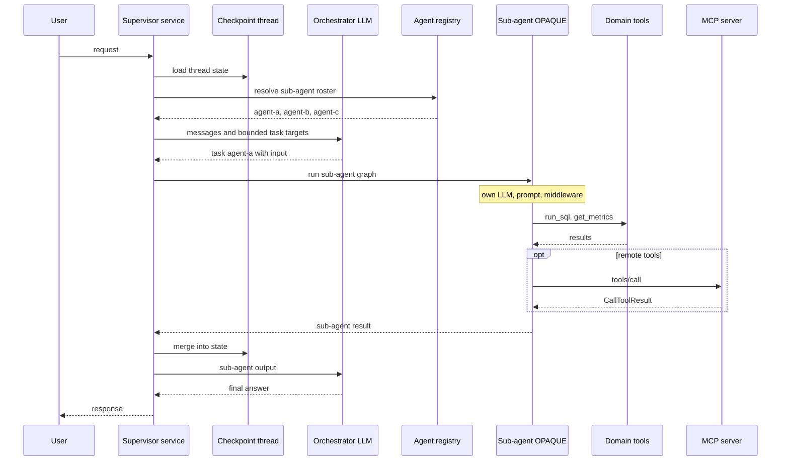
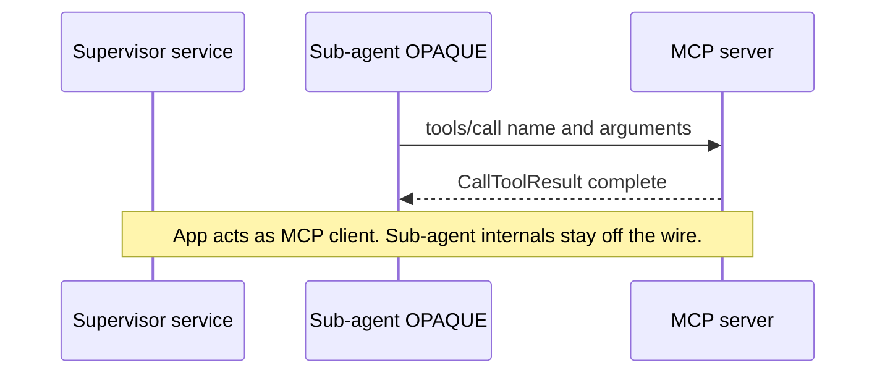
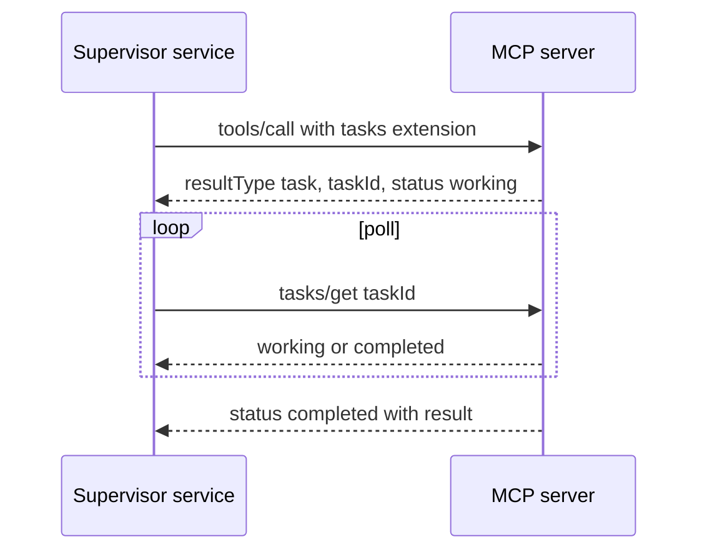

# Deep Agent Architecture vs MCP Surfaces

> Can MCP (tools, Tasks extension, and related extensions) express what production
> **deep-agent  systems** do  and where do protocol gaps remain?

Aligned with [Agents WG approaches](https://github.com/modelcontextprotocol/agents-wg/pull/5) and
[mcp-agent-tools.md](./mcp-agent-tools.md).

---

## Research question

Production systems built with **Deep Agents / LangGraph** use a supervisor that delegates to
**in-process sub-agents** (`task()`), each with its own LLM, tools, and middleware. MCP is often
used for **remote tools**, not as the sub-agent runtime.

**Question:** Which parts of that architecture have an MCP wire equivalent  and which parts stay application/framework-owned?

---


## Deep agent architecture (reference)

Typical production layout:

```text
Client (HTTP / chat UI)
        ↓
Supervisor service (application — not necessarily an MCP client)
        ↓
Orchestrator — top-level deep agent
        │
        ├── task() → Sub-agent A  (local: own LLM + tools + middleware)
        ├── task() → Sub-agent B  (local: remote MCP servers)
        ├── task() → Sub-agent C  (local, may nest further)
        │
        ├── generic tools
        └── external agents        (e.g. A2A — optional)
        │
        ├── agent registry         (discover / register sub-agents)
        ├── middleware             (routing, context, tracing, summarization)
        └── checkpoint / thread    (conversation memory)
```

**Delegation boundary:** the supervisor sees **named sub-agents**, not every domain tool.
Sub-agent tools (`run_sql`, `search_docs`, …) stay inside the sub-agent — not on the supervisor.

---


## Sequence diagram — deep agent flow (application layer)

What happens **inside** a supervisor service. Nothing here is standardized MCP unless
remote tools or MCP-hosted agents are invoked.




---


## MCP surfaces (what the protocol defines)

What exists **on the wire** between an MCP client and server:


| Surface            | Identifier / method              | Role                                    |
| ------------------ | -------------------------------- | --------------------------------------- |
| Tool call          | `tools/call`                     | Stateless request → result              |
| Tool discovery     | `tools/list`                     | Flat list of tool schemas               |
| Async job          | `io.modelcontextprotocol/tasks`  | `resultType: "task"` → `tasks/get` poll |
| Workflow docs      | `io.modelcontextprotocol/skills` | `resources/read` `skill://…`            |
| Rich UI            | `io.modelcontextprotocol/ui`     | `_meta.ui` on tools/resources           |
| User input mid-job | Tasks + MRTR                     | `input_required` → `tasks/update`       |


MCP does **not** define: supervisor graphs, `task(agent=…)`, agent registries, checkpoints,
middleware, or model routing.

---


## Sequence diagram — MCP surface (remote tool call only)

When the deep-agent stack reaches **out** to MCP (optional attachment in diagram above):




With **Tasks extension** for long remote work:




---


## Deep agent vs MCP — component mapping


| Deep agent component                   | MCP surface today                      | Match?                       |
| -------------------------------------- | -------------------------------------- | ---------------------------- |
| Orchestrator / supervisor loop         | —                                      | ❌ Application-owned          |
| `task()` delegation to named sub-agent | —                                      | ❌ No wire primitive          |
| Agent registry (sub-agent roster)      | `tools/list` (flat)                    | ❌ No `agents/list`           |
| Sub-agent LLM + middleware             | —                                      | ❌ In-process only            |
| Domain tools inside sub-agent          | Server-internal or separate MCP server | ⚠️ Not visible to supervisor |
| Checkpoint / thread memory             | —                                      | ❌ Application-owned          |
| Model routing middleware               | —                                      | ❌ Application-owned          |
| Remote capability                      | `tools/call`                           | ✅                            |
| Long-running remote work               | Tasks extension                        | ✅                            |
| Workflow instructions                  | Skills extension                       | 🧪 Draft                     |
| Rich result UI                         | MCP Apps                               | ✅ (orthogonal)               |
| External agents                        | A2A (separate protocol)                | ✅ Parallel track             |


---


## Alternative topology (WG Approach 1)

If each sub-agent were **re-hosted as an MCP server** (one tool per agent), an MCP **client**
could play supervisor — but that **changes the architecture**:

```text
Deep agent (today)     MCP Approach 1 (different shape)
─────────────────      ────────────────────────────────
local task()      →    tools/call invoke_agent_a
in-process sub-agents → opaque server-side agent loops
one service       →    N MCP servers + MCP client supervisor
```

See [mcp-agent-tools.md](./mcp-agent-tools.md) for production examples (sync and async).

This is **interoperable** but **not equivalent** to in-process deep-agent delegation.

---


## Gaps worth raising with the WG


| Gap                              | Deep agent need                        | MCP today               |
| -------------------------------- | -------------------------------------- | ----------------------- |
| **Agent discovery**              | Supervisor reasons over agent names    | Flat `tools/list` only  |
| **Portable delegation boundary** | Registry defines who can be tasked     | Per-app config          |
| **Caller-directed messaging**    | Sub-agent asks supervisor LLM mid-loop | Elicitation = user only |
| **Job vs conversation state**    | Thread checkpoint ≠ async job          | Tasks = job handle only |


**Not asking MCP to own:** graph execution, checkpoints, middleware, model routing.

---


## Primitive coverage (reference)


| Production need                 | Deep agent stack            | MCP surface       | Gap?                  |
| ------------------------------- | --------------------------- | ----------------- | --------------------- |
| Tool call                       | Sub-agent uses domain tools | ✅ `tools/call`    | No (remote)           |
| Long-running remote work        | App tracks async MCP jobs   | ✅ Tasks           | No (with poll)        |
| Named sub-agent delegation      | `task(agent=…)`             | ❌                 | **Yes**               |
| Agent / sub-agent registry      | Bounded supervisor surface  | ⚠️ client config  | **Yes — portability** |
| Thread / checkpoint             | App database                | ❌                 | Out of scope          |
| Sub-agent → supervisor mid-loop | Parent LLM callback         | ❌                 | **Yes**               |
| Parallel sub-agents             | Fan-out in graph            | ⚠️ multiple calls | Partial               |
| Model routing                   | Middleware                  | ❌                 | Out of scope          |
| Workflow docs                   | Prompts / skills            | 🧪 Skills         | Complements agents    |
| Rich UI                         | App rendering               | ✅ MCP Apps        | Orthogonal            |


### Layering (WG direction)

```text
Agent capability card  ← gap (discovery / delegation boundary)
Task                   ← SEP-2663 ✅
Sub-agent as MCP tool  ← Approach 1 ✅ (different topology)
Tool                   ← core ✅
```

---


## Summary


| Layer                                                        | Who owns it                |
| ------------------------------------------------------------ | -------------------------- |
| Supervisor graph, `task()`, registry, checkpoint, middleware | **Deep agent application** |
| Remote tools, async job handles, skills, UI extensions       | **MCP surfaces**           |


MCP **complements** deep-agent architectures (remote tools + Tasks). It does **not** yet
**surface** the in-process supervisor/sub-agent model on the wire. The open WG question is
whether a lightweight **agent capability card** is enough — without putting LangGraph on the protocol.

---


## References

- [PR #20 — this research](https://github.com/modelcontextprotocol/agents-wg/pull/20)
- [Agents WG approaches (PR #5)](https://github.com/modelcontextprotocol/agents-wg/pull/5)
- [mcp-agent-tools.md](./mcp-agent-tools.md)
- [SEP-2663 Tasks Extension](https://modelcontextprotocol.io/seps/2663-tasks-extension)
- [LangChain Deep Agents](https://docs.langchain.com/oss/python/deepagents/harness)
- [2026-04-21 — sub-agent communication](https://github.com/modelcontextprotocol/agents-wg/blob/main/meetings/2026-04-21.md)
- [2026-05-29 — Tasks conformance, versioning](https://github.com/modelcontextprotocol/agents-wg/blob/main/meetings/2026-05-29.md)

