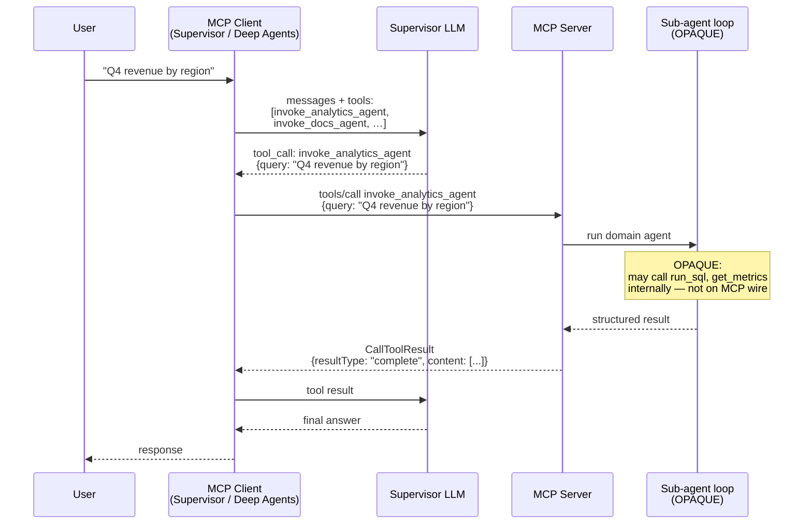
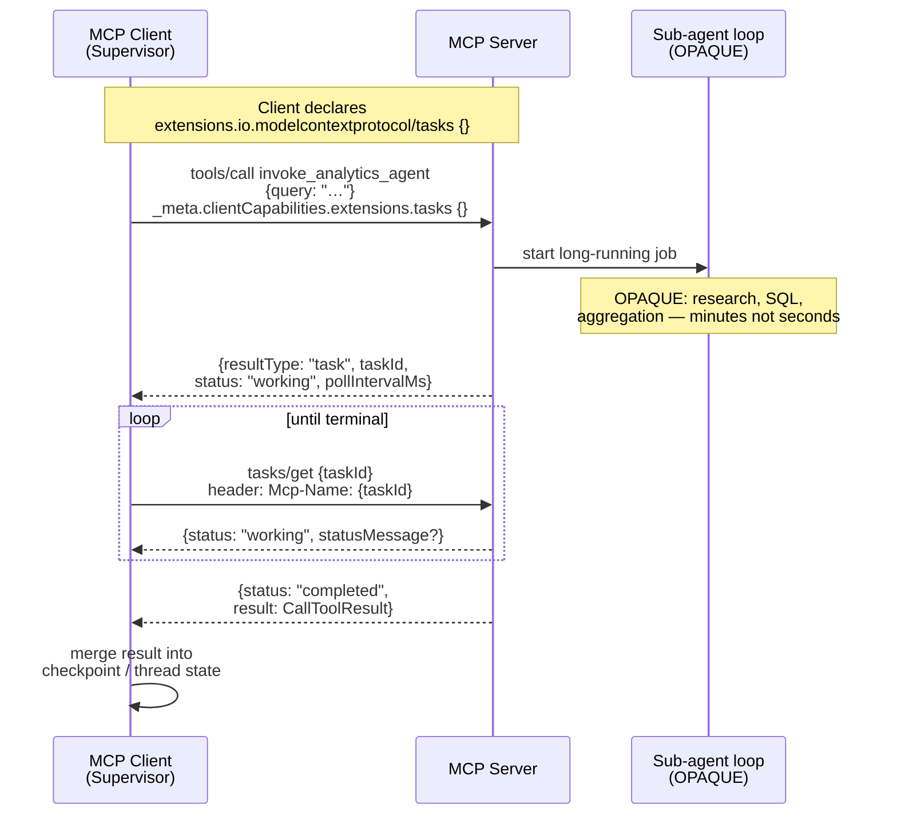
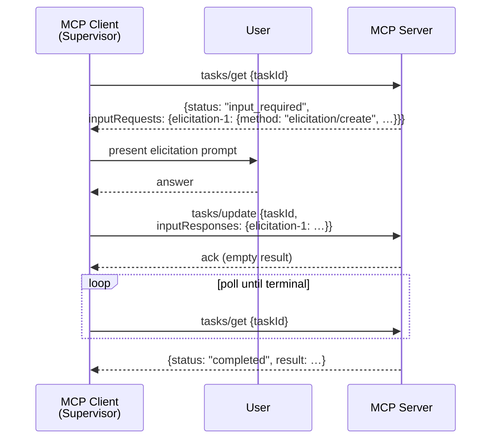
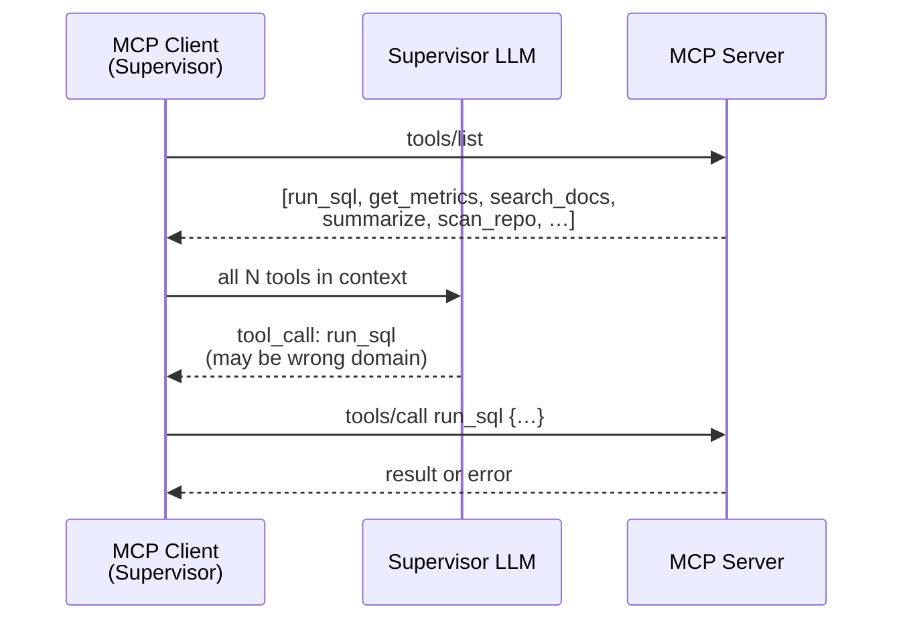
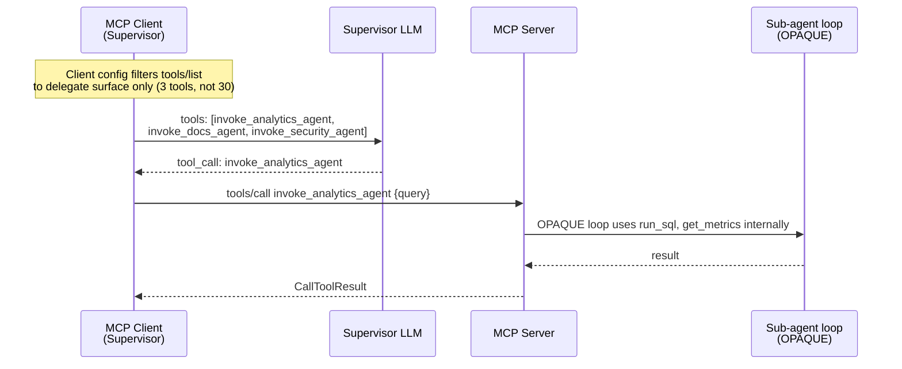
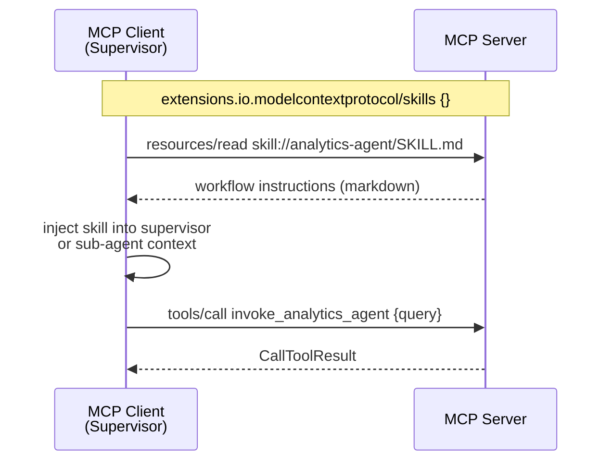
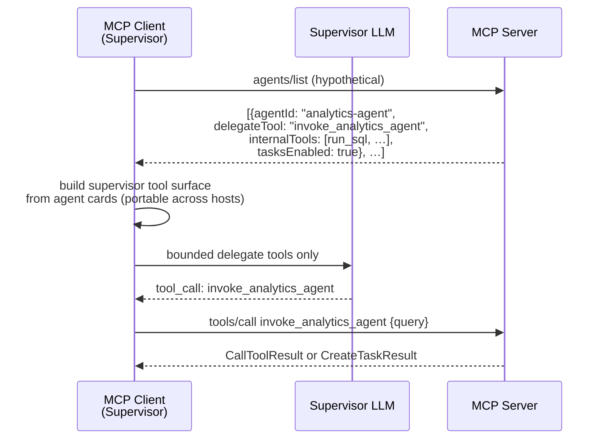

# Mapping Deep Agent Architecture to MCP Agents

> Observations on production deep-agent systems and how they map onto MCP primitives,
> and where protocol gaps remain after existing features and extensions are applied.

Production reference: [agent-supervisor-service](https://github.com/opsera-insights/opsera-ai/tree/main/agent-supervisor-service)
(Deep Agents supervisor + MCP-backed sub-agents).

Aligned with [Agents WG approaches](https://github.com/modelcontextprotocol/agents-wg/pull/5) and
diagram style from [mcp-agent-tools.md](./mcp-agent-tools.md).

---

## MCP stack (current model)

```text
MCP Core                    Extensions
├── Tools                   ├── Tasks (SEP-2663 Final) — io.modelcontextprotocol/tasks
├── Resources               ├── Skills (SEP-2640 Draft) — io.modelcontextprotocol/skills
├── Prompts                 ├── MCP Apps (Stable) — io.modelcontextprotocol/ui
└── Transports              └── Events (Triggers WG — ideating)
```

---

## Deep-agent pattern (production system)

```text
User
 ↓
Supervisor          ← small surface: delegation + generic tools
 ↓ task(agent, …)
Sub-agent             ← domain tools visible for sub-agent only
 ↓
Tools (native + optional MCP)
```

**Delegation boundary:**

```text
Supervisor
  ├── analytics-agent
  ├── docs-agent
  └── security-agent

analytics-agent
  ├── run_sql
  ├── get_metrics
  └── dashboards

docs-agent
  ├── search_docs
  └── summarize
```

The delegation bounds **reasoning cost** and reduces wrong tool selection.
Sub-agent tools are registered on the sub-agent config only—not on the supervisor.

---

## What existing MCP already covers

Reviewers on [PR #20](https://github.com/modelcontextprotocol/agents-wg/pull/20) are correct that
much of the production deep-agent pattern maps to **Approach 1** (agent hosted behind a tool call)
with the client acting as supervisor:

| WG approach | Production mapping | MCP primitive |
|-------------|-------------------|---------------|
| **Approach 1** | Sub-agent = `tools/call` on `invoke_*_agent` | Core `tools/call` |
| **Tasks extension** | Long-running sub-agent work | `resultType: "task"` + `tasks/get` |
| **Skills extension** | Workflow instructions for a domain | `resources/read` `skill://…` |
| **MCP Apps** | Rich UI on tool result | `_meta.ui.resourceUri` |

The sections below use sequence diagrams to show **what works today**, **what Tasks adds**,
and **what gaps remain**.

---

## Flow 1: Client-as-supervisor, sub-agent-as-tool (sync)

Maps to [Approach 1](https://github.com/modelcontextprotocol/agents-wg/pull/5) and Deep Agents
`task(agent="analytics-agent", …)` when the sub-agent is one MCP tool.

### Interface

| Field | Value |
|---|---|
| Supervisor | MCP Client (LangGraph / Deep Agents harness) |
| Sub-agent surface | Tool name e.g. `invoke_analytics_agent` |
| Input | `{query: string, …}` (server-defined schema) |
| Output | `CallToolResult` with `resultType: "complete"` |
| Extension | None required |

### Behavior

1. Supervisor LLM receives a **bounded tool list** (delegate tools only, not flat domain tools).
2. LLM selects `invoke_analytics_agent`.
3. Client issues `tools/call`.
4. Server runs an internal agent loop (OPAQUE) and returns the final result.
5. Supervisor LLM incorporates the result and responds to the user.

### Sequence diagram



### Opaque boundary

Everything inside the server's sub-agent loop is opaque from the MCP client's perspective.
The client has no visibility into:

- Which internal tools the sub-agent invoked
- The sub-agent's system prompt or model choice
- Intermediate reasoning steps

The contract is `tools/call` → `CallToolResult`. This matches production patterns documented
in [mcp-agent-tools.md](./mcp-agent-tools.md) (Q Business, GitHub Copilot).

### Limitations

**MCP-induced:**

- No standard `agents/list`; supervisor tool surface is **client-configured**, not server-advertised.
- No mid-loop message from sub-agent back to supervisor LLM (see Flow 5).

---

## Flow 2: Sub-agent-as-tool with Tasks extension (async)

Maps to Approach 1 + [SEP-2663 Tasks](https://modelcontextprotocol.io/seps/2663-tasks-extension).
Same delegation pattern; server returns a task handle instead of blocking.

### Interface

| Field | Value |
|---|---|
| Extension | `io.modelcontextprotocol/tasks` in per-request client capabilities |
| Task methods | `tasks/get`, `tasks/update`, `tasks/cancel` |
| Async discriminator | `resultType: "task"` on initial `tools/call` response |

### Behavior

1. Client declares Tasks extension in `_meta.io.modelcontextprotocol/clientCapabilities`.
2. Server may return `CreateTaskResult` instead of `CallToolResult` for long work.
3. Client polls `tasks/get` until terminal status (`completed`, `failed`, `cancelled`).
4. On `completed`, `result` field carries the same shape `tools/call` would have returned.

### Sequence diagram



### Opaque boundary

Tasks expose **job state** (`working`, `statusMessage`, `completed.result`), not sub-agent
inner-loop steps. Polling is client responsibility unless the host wraps it transparently.

### Limitations

**MCP-induced:**

- Task state ≠ supervisor conversation checkpoint (client-owned).
- `subscriptions/listen` + Tasks notifications still a conformance fast-follow.
- Missing `Mcp-Name` on `tasks/get|update|cancel` → `-32001` per SEP-2243/2663.

---

## Flow 3: `input_required` mid-flight (Tasks + MRTR)

When the sub-agent needs user input during a long task.

### Interface

| Field | Value |
|---|---|
| Status | `input_required` on `tasks/get` response |
| Pending work | `inputRequests` map (MRTR shape) |
| Client reply | `tasks/update` with `inputResponses` |

### Sequence diagram



### Limitations

**Protocol gap:**

- `input_required` targets the **user** via elicitation, not the **supervisor LLM**.
- No standard primitive for sub-agent → parent-agent messaging mid-loop
  ([2026-04-21 meeting](https://github.com/modelcontextprotocol/agents-wg/blob/main/meetings/2026-04-21.md)).

---

## Flow 4: Tool sprawl (default MCP) vs bounded delegation (production)

Contrasts what MCP exposes by default with what deep-agent supervisors use.

### Behavior — tool sprawl (anti-pattern MCP enables)

1. Client calls `tools/list`.
2. Server returns **all** tools including domain-level `run_sql`, `search_docs`, etc.
3. Supervisor LLM sees every tool; wrong-domain picks increase cost and latency.

### Sequence diagram — tool sprawl



### Behavior — bounded delegation (production pattern)

1. Client configures supervisor to see **delegate tools only**
   (`invoke_analytics_agent`, `invoke_docs_agent`, …).
2. Domain tools exist only inside the server sub-agent loop (Flow 1).

### Sequence diagram — bounded delegation



### Gap

Client-side filtering **works** but is **not portable**: a new host connecting to the same
server gets full `tools/list` unless it reimplements the same filter. A server-advertised
**agent capability card** (`agents/list` or equivalent) would standardize this boundary.

---

## Flow 5: Skills before delegation (optional layer)

[SEP-2640 Skills](https://github.com/modelcontextprotocol/modelcontextprotocol/pull/2640) —
workflow docs over MCP resources; does not replace sub-agent delegation.

### Sequence diagram



### Limitations

Skills teach **how** to orchestrate; they do not bind **which tools** the supervisor may call.

---

## Flow 6: Proposed — server-advertised agent capability card

Not implemented. Sketches [Approach 3 / 6](https://github.com/modelcontextprotocol/agents-wg/pull/5).

### Sequence diagram



---

## MCP primitive coverage (summary)

| Production need | Deep Agents | MCP today | Gap? |
|-----------------|-------------|-----------|------|
| Tool call | Sub-agent invokes tools | ✅ `tools/call` | No |
| Long-running work | Supervisor tracks jobs | ✅ Tasks extension | No (with client poll) |
| Agent / delegation boundary | 3 delegate tools, not 30 | ⚠️ Client filter only | **Yes — portability** |
| Thread / checkpoint memory | Mongo / LangGraph | Client-owned | Out of MCP scope |
| Sub-agent → supervisor mid-loop | Parent LLM callback | ❌ No primitive | **Yes — caller-directed messaging** |
| Parallel sub-agents | Fan-out in graph | ⚠️ Multiple `tools/call` | Partial — no task DAG |
| Model routing | Middleware per call | Client-only | Out of scope for v0 |

---

## Proposed layering (direction for WG)

```text
Agent          ← definition + capability card (Flow 6 — gap)
 ↓
Task           ← long-running unit of work (Flow 2 — SEP-2663)
 ↓
Sub-agent      ← executor behind tool (Flow 1 — Approach 1)
 ↓
Tool           ← MCP core ✅
```

---

## Notes

This document represents ongoing exploration. **Existing MCP features cover Approach 1 + Tasks.**
The open questions for the WG are whether **agent capability discovery** (Flow 4 vs Flow 6) and
**caller-directed messaging** (Flow 3 limitation) warrant protocol work.

Feedback, corrections, and alternative approaches are welcome.

---

## References

- [PR #20 — this research](https://github.com/modelcontextprotocol/agents-wg/pull/20)
- [Agents WG approaches (PR #5)](https://github.com/modelcontextprotocol/agents-wg/pull/5)
- [mcp-agent-tools.md](./mcp-agent-tools.md) — production Approach 1 examples + diagram style
- [SEP-2663 Tasks Extension](https://modelcontextprotocol.io/seps/2663-tasks-extension)
- [LangChain Deep Agents](https://docs.langchain.com/oss/python/deepagents/harness)
- [2026-04-21 — agents vs tasks, sub-agent communication](https://github.com/modelcontextprotocol/agents-wg/blob/main/meetings/2026-04-21.md)
- [2026-05-29 — tasks conformance, extension versioning](https://github.com/modelcontextprotocol/agents-wg/blob/main/meetings/2026-05-29.md)
