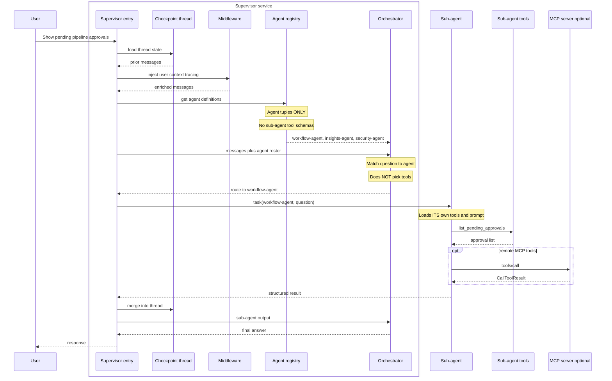
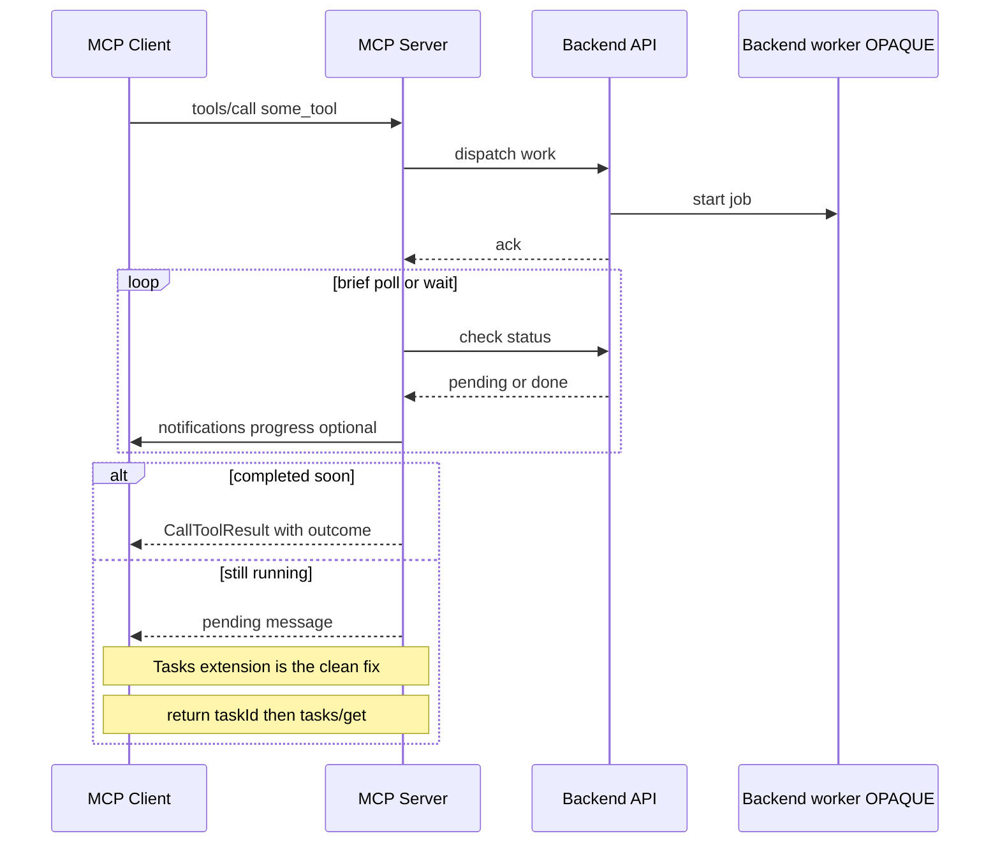
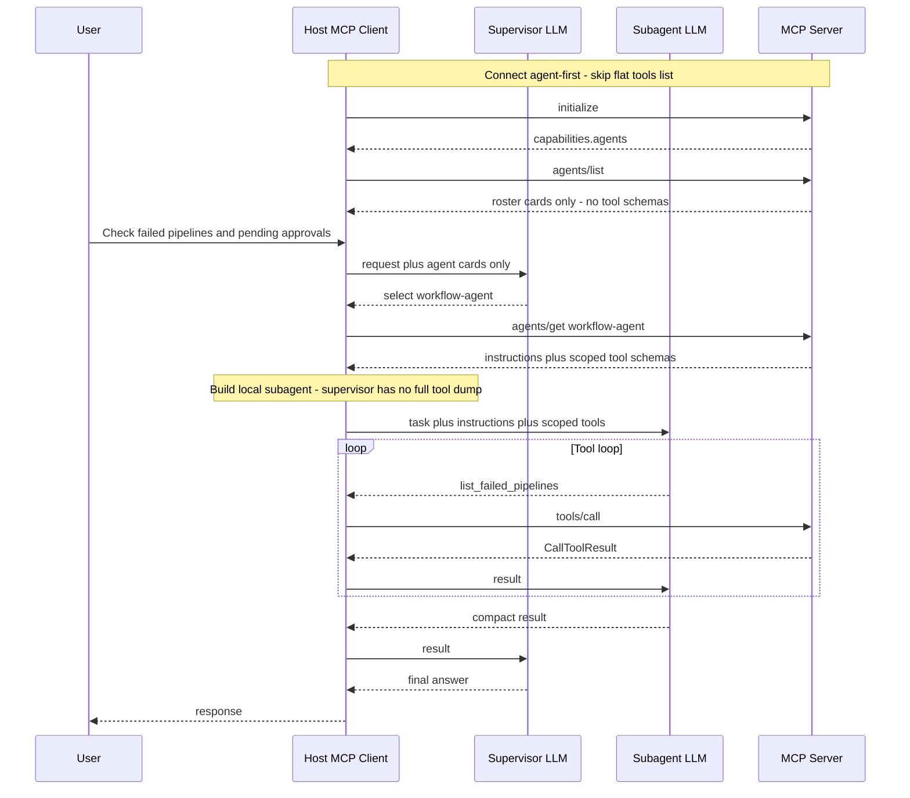

# Deep Agent Architecture vs MCP Agents

> Compare how **deep-agent** systems build effective multi-agent orchestration with what
> **MCP Agents** offers today — and one concrete improvement: **agent definition**.

---

## 1. What this compares

**Deep-agent architecture** (supervisor + registered sub-agents + nested specialists) builds
effective agents: bounded context, clear routing, scoped tools.

**MCP Agents** is strong at remote tools and Tasks, but does not yet expose a **delegation /
agent-definition** layer on the wire.

This document:

1. Introduces **Deep Agents** ([docs](https://docs.langchain.com/oss/python/deepagents/subagents)) — lineage from LangChain / LangGraph, capabilities, skills, and how tools/subagents attach
2. Contrasts that shape with a typical MCP **server / tools** sequence
3. Proposes **Proposal 1: agent-first discovery** (`agents/list` → `agents/get` → scoped `tools/call`), including a **Python SDK registration sketch** for builders (§6.6)
4. Captures **WG session Q&A** (approaches, objections, pros/cons) in the FAQ

Other Agents WG approaches exist ([PR #5](https://github.com/modelcontextprotocol/agents-wg/pull/5)). This doc uses the **supervisor–subagent tree** as the reference stress test.

### Terms used throughout

| Term | Meaning |
| ---- | ------- |
| **Host / MCP client** | App that owns the LLM(s) and speaks MCP |
| **MCP server** | Exposes tools / resources / prompts (no LLM required) |
| **Roster / agent card** | `{ name, description, capabilities[] }` — **labels only**, no tool schemas |
| **Scoped tools** | Tool schemas visible only after selecting an agent |
| **Progressive disclosure** | Small discovery first; detail on demand |
| **Catalog mode** | Host builds a **local** sub-agent LLM from `agents/get`; leaf work still uses `tools/call` on the same server |
| **Capability negotiation** | `initialize` advertises `capabilities.agents` → host chooses agent-first vs flat tools |

---

## 2. Deep Agents primer — lineage, capabilities, skills, registration

[Deep Agents](https://docs.langchain.com/oss/python/deepagents/overview) (`deepagents`) is an
**agent harness** built on LangChain primitives and the LangGraph runtime: planning, filesystem
context, skills, memory, subagents, and human-in-the-loop come packaged via
[`create_deep_agent`](https://reference.langchain.com/python/deepagents/graph/create_deep_agent).
MCP fits naturally as a **leaf tool** source under a specialist. The WG ask later is a portable
**agent definition** so hosts can route the same way without shipping that harness on the wire.

### 2.1 Lineage: LangChain → LangGraph → Deep Agents

| Layer | Optimized for | Mental model |
| ----- | ------------- | ------------ |
| **[LangChain](https://docs.langchain.com/)** | Composing LLM calls with tools, prompts, retrievers | **Chains** — prompt → model → tool → parse. Strong for linear flows; awkward once control flow, retries, and branching dominate |
| **[LangGraph](https://docs.langchain.com/oss/python/langgraph/overview)** | Stateful multi-actor apps | **Graphs** — nodes, edges, checkpoints; orchestration, cycles, interrupt/resume, thread memory, streaming |
| **Deep Agents** | Production agent harness on those blocks | **Deeper SDK** — same tool-calling loop, plus planning, files, skills, memory, subagents, HITL |

```text
LangChain          LangGraph              Deep Agents
─────────          ─────────              ───────────
tool / chain       graph runtime          agent harness
compose steps      orchestrate + memory   plan · files · skills · subagents · HITL
                   checkpoint / stream    create_deep_agent(...)
```

- **LangChain** — primitives: chat models, `@tool` / `StructuredTool`, LCEL, `create_agent`
- **LangGraph** — durable runtime: state graphs, checkpointers, interrupts, streaming
- **Deep Agents** — batteries-included harness: pass model, `tools`, optional `subagents` /
  `skills` / `memory` / middleware; get `write_todos`, virtual filesystem, progressive skills,
  and a built-in `task` tool for delegation

You can also stay on `create_agent` + LangGraph alone (our POC does, for lean Groq-friendly
routing) when you want the routing pattern without the full harness surface.

### 2.2 What Deep Agents supports

| Area | Built-in support |
| ---- | ---------------- |
| **Execution** | Custom / MCP tools; virtual filesystem (`ls`, `read_file`, `write_file`, `edit_file`, `glob`, `grep`, …); optional sandbox `execute`; interpreters |
| **Context** | Skills (`SKILL.md`); memory (`AGENTS.md`); summarization / context offloading; prompt caching where supported |
| **Delegation** | `write_todos` for planning; `task` for subagents (general-purpose or custom) with isolated context |
| **Steering** | HITL via `interrupt_on` (pause before sensitive tool calls) |
| **Durability** | LangGraph checkpointer / store — threads, resume, long runs |
| **Customization** | `system_prompt`, `middleware`, `backend`, `permissions`, `response_format`, harness profiles |

| Concept | Role |
| ------- | ---- |
| **Supervisor** | Sees subagent **names + descriptions**; delegates via `task` |
| **SubAgent** | `name`, `description`, `system_prompt`, optional `tools`, `model`, `middleware`, `skills` |
| **CompiledSubAgent** | Pre-built graph exposed through the same `task` tool |
| **AsyncSubAgent** | Remote / background worker |
| **Nesting** | A subagent can own further subagents |

### 2.3 What is `SKILL.md`?

A **skill** is a directory with a `SKILL.md` ([Agent Skills](https://agentskills.io/) standard)
plus optional `scripts/`, `references/`, `assets/`. It holds reusable how-to knowledge —
workflows, conventions, templates — without stuffing every procedure into the system prompt.

```md
---
name: release-readiness
description: Use when assessing go/hold for a service release — pipelines, CVEs, risk.
---

# Release readiness

## Instructions
1. Gather failed pipelines and pending approvals for the named service.
2. Check recent outages / CVEs for that domain.
3. Produce a short go/hold with evidence.
```

**Progressive disclosure:**

| Level | Loads | When |
| ----- | ----- | ---- |
| 1. Metadata | `name` + `description` from frontmatter | Startup (compact) |
| 2. Instructions | Full `SKILL.md` body | When the agent selects the skill |
| 3. Resources | Files under the skill dir | As instructions reference them |

```python
agent = create_deep_agent(
    model="anthropic:claude-sonnet-4-6",
    backend=FilesystemBackend(root_dir="./my-project"),
    skills=["./my-project/skills/"],   # dirs containing */SKILL.md
    tools=[...],
)
```

Skills are **how** (on-demand know-how). Subagents are **who** (specialists you delegate to).
A specialist can carry its own `skills=` paths. Separately, **memory** (`AGENTS.md` via
`memory=`) is always-on preferences; skills stay on-demand.

### 2.4 How tools and subagents attach

Nothing is auto-discovered from arbitrary modules. You pass callables, LangChain tools, or
MCP-backed tools into `create_deep_agent`, and specialists via `subagents=`.

**Domain tools → `tools=`** (merged with harness built-ins such as `write_todos`, filesystem,
`task`):

```python
@tool
def list_pending_approvals(service: str) -> str:
    """List pending pipeline approvals for a service."""
    ...

agent = create_deep_agent(
    model="...",
    tools=[list_pending_approvals, ...],
    system_prompt="...",
)
```

To hide built-ins, use a harness profile / `excluded_tools` (see Deep Agents docs).

**Specialists → `subagents=`** (their tool schemas never appear on the supervisor):

```python
create_deep_agent(
    name="supervisor",
    subagents=[
        {
            "name": "workflow-agent",
            "description": "Pipelines, approvals, run history, connectors",
            "system_prompt": "...",
            "tools": workflow_tools,
            "skills": ["./skills/workflow/"],  # optional
        },
    ],
    skills=["./skills/shared/"],
    checkpointer=...,
)
```

Runtime: supervisor gets a **roster** (`name` + `description`) → calls
`task(subagent_type, description)` → specialist runs with its own prompt, tools, and optional
skills → returns a compact result.

Apps often wrap the same shape in a registry (`register_agent(...)` at import, then
`subagents=get_all_agent_configs()`), or hand-roll a lean `task` tool on `create_agent` as in
our POC.

| Surface | Supervisor | Specialist |
| ------- | ---------- | ---------- |
| Agent tuple (`name`, `description`, …) | Yes | — |
| Tool schemas | No | Own tools only |
| Skill metadata | Names / descriptions | Full body when invoked |

Similar Subagent ecosystem:

- [LangChain Deep Agents](https://docs.langchain.com/oss/python/deepagents/subagents) — `subagents=` + `task()`
- [Claude Code–style setups](https://towardsdatascience.com/claude-skills-and-subagents-escaping-the-prompt-engineering-hamster-wheel/) — main agent only knows specialists
- [Vercel AI SDK subagents](https://ai-sdk.dev/docs/agents/subagents) — parent delegates; child has own context


---

## 3. Inside a deep-agent system

Shape that MCP Agents would help **advertise**, not re-host as a full graph runtime.

### Objects

```text
Thread (conversation / checkpoint id)
  └── Supervisor deep agent
        ├── Agent registry entries (tuples)
        │     name, description, capabilities / examples
        │     (tools stay OFF this list)
        ├── Middleware stack
        ├── Own generic tools (optional)
        └── task(name, input) → Sub-agent
              ├── Own model + system prompt
              ├── Own tool schemas
              ├── Own middleware
              └── Optional: further sub-agents (tree)
                    └── Optional: MCP servers as leaf tools
```

### Middleware

| Concern | Role |
| ------- | ---- |
| **Routing** | Roster in prompt; NL match to `name` / `description` |
| **Context** | User/org profile; thread history from checkpoint |
| **Tracing** | Per-agent spans for wrong routes and tool picks |
| **Model tier** | Fast model for easy turns; larger for hard ones |
| **Latency** | Small supervisor context (agents, not 70 tools) |
| **RAG / data** | Retrieval behind the subagent, not the supervisor |

**Checkpoint / thread** = conversation memory (app state).  
**MCP Task** = async handle for one remote job. Different things.

### One turn, end to end



---

## 4. Typical MCP server sequence

What hosts talk to in production: an **MCP server** exposing tools — not a first-class agent
roster. Sometimes the tool wraps a remote/opaque worker (see
[mcp-agent-tools.md](./mcp-agent-tools.md)); that worker stays behind `tools/call`.



**Works well:** standard remote invoke; Tasks cleans up long polls.

---

## 5. Deep agent vs MCP

| Capability | Deep-agent system | MCP today |
| ---------- | ----------------- | --------- |
| Named specialist roster | Agent registry | Flat `tools/list` |
| Delegate by NL match to agent | `task(agent, input)` | No standard primitive |
| Bounded tools per specialist | Tools only on that subagent | All tools if listed on one server |
| Nested specialists | Subagent owns subagents | Not modeled |
| Conversation memory | Checkpoint / thread | App-owned |
| Middleware (routing, model tier, RAG, traces) | App stack | Out of scope |
| Remote leaf tools | Subagent may call MCP | ✅ `tools/call` |
| Long remote jobs | App + optional Tasks | ✅ Tasks |
| Workflow / how-to docs | Prompts; optional Skills | 🧪 Skills |
| Rich UI | App or MCP Apps | ✅ MCP Apps |
| Opaque remote agent-as-tool | Optional | ✅ Approach C (below) |

---

## 6. Proposal 1: Agent-first discovery

> **After sync with WG discussion** (including comments from [@lucabutboring](https://github.com/lucabutboring) on catalog-style local sub-agents):  
> `agents/list` is **roster-only** (no tool names/schemas). Hosts that advertise
> `capabilities.agents` must **not** call flat `tools/list` at connect — otherwise the
> supervisor sees agents **and** all tools (square one). Tool schemas appear only after
> `agents/get` for the selected agent; leaf execution stays `tools/call` on the **same**
> server. LLMs stay on the host.

Deep agents scale because the supervisor sees an **agent registry**, not every tool:

```text
BAD (flat tools as discovery):
  Orchestrator sees 70 tool schemas → picks the tool itself → sprawl, mis-routes

GOOD (agent-first discovery):
  Orchestrator sees 3 agent cards → selects workflow-agent →
  host loads THAT agent’s tools only → specialist picks the tool
```

### 6.1 What changes on the wire (additive)

| Piece | Role |
| ----- | ---- |
| `initialize` → `capabilities.agents` | Host knows to use agent-first path |
| `agents/list` | Roster only: name, description, **capability labels** |
| `agents/get` (or select) | Optional instructions + **scoped tool schemas** |
| `tools/call` | Unchanged — same server executes tools |

Protocol + host policy define the behavior. SDKs expose matching registration helpers
(see **§6.6**); the JSON-RPC methods remain the contract.

### 6.2 Expected sequence



### 6.3 Example payloads

**`agents/list` (roster — labels only):**

```jsonc
{
  "agents": [
    {
      "name": "workflow-agent",
      "description": "Pipelines, approvals, deployments, incidents",
      "capabilities": ["failed pipelines", "pending approvals", "change requests"]
    },
    {
      "name": "research-agent",
      "description": "Outages, CVEs, internal runbooks",
      "capabilities": ["web search", "internal docs"]
    },
    {
      "name": "insights-agent",
      "description": "DORA, error budget, release risk",
      "capabilities": ["dora", "risk score", "charts"]
    }
  ]
}
```

**Not** in this payload: `tools: [...]`, full schemas, required `model`, required `systemPrompt`
(model / prompt may appear later as **optional**, host-overridable).

**`agents/get` (first time tools appear):**

```jsonc
{
  "agent": "workflow-agent",
  "instructions": "You handle CI/CD and approvals for the named service.",
  "tools": [
    {
      "name": "list_failed_pipelines",
      "description": "List recent failed CI/CD runs",
      "inputSchema": { "type": "object", "properties": { "service": { "type": "string" } } }
    },
    {
      "name": "list_pending_approvals",
      "description": "List approval gates still waiting",
      "inputSchema": { "type": "object", "properties": { "service": { "type": "string" } } }
    }
  ]
}
```

**Nesting (later / optional)** — child agents / tools as `{ type, name }` refs, **same-server-only**
for MVP.

### 6.4 Why this benefits users (not “extra work”)

Users never call `agents/list`. Hosts do. One extra RPC per specialist choice is **host
plumbing**. Users get: better routing, fewer wrong tool picks, lower token cost on large
servers (POC: flat MCP supervisor context much larger than a 3-card roster).

### 6.5 Does this break existing MCP?

**No if additive.** Servers without `capabilities.agents` keep flat `tools/list`. Old clients
ignore unknown capabilities. `tools/call` stays the execution path. Breaking would be
*removing* flat tools for everyone — Proposal 1 does not do that.

### 6.6 SDK registration for builders (V1 sketch)

Builders keep registering **tools** as today. Agents are a thin registry that **points at tool
names**. Wire format is **JSON**; Markdown authoring can come later as an optional loader.

**Mental model**

```text
@mcp.tool(...)     → ToolManager   (schemas + handlers)   — unchanged
@mcp.agent(...)    → AgentManager  (card + tool name refs) — new
agents/list        → cards only
agents/get(name)   → resolve refs → Tool[] from ToolManager
tools/call         → ToolManager   — unchanged
```

**How builders register tools onto a subagent**

1. Define tools with `@mcp.tool` (same as today).
2. Register an agent and pass `tools=[...]` as **string names** of those tools.
3. Same tool may appear on more than one agent if needed.

```python
from mcp.server import MCPServer

mcp = MCPServer("sdlc")

# 1) Tools — registered globally (handlers + schemas), as today
@mcp.tool()
def list_failed_pipelines(service: str) -> str:
    """List recent failed CI/CD runs for a service."""
    ...

@mcp.tool()
def list_pending_approvals(service: str) -> str:
    """List approval gates still waiting."""
    ...

@mcp.tool()
def search_cves(query: str) -> str:
    """Search CVE / advisories."""
    ...

# 2) Agents — roster card + which tools belong to this specialist
@mcp.agent(
    name="workflow-agent",
    description="Pipelines, approvals, deployments",
    capabilities=["failed pipelines", "pending approvals"],
    tools=["list_failed_pipelines", "list_pending_approvals"],  # bind by name
    instructions="You handle CI/CD for the named service.",      # optional
)
def workflow_agent():
    """Marker for the agent registry (no LLM on the server)."""
    ...

@mcp.agent(
    name="research-agent",
    description="Outages, CVEs, runbooks",
    capabilities=["web search", "CVEs"],
    tools=["search_cves"],
)
def research_agent():
    ...
```

Equivalent without a decorator body — dict / `add_agent` (Deep Agents–like):

```python
mcp.add_agent({
    "name": "workflow-agent",
    "description": "Pipelines, approvals, deployments",
    "capabilities": ["failed pipelines", "pending approvals"],
    "tools": ["list_failed_pipelines", "list_pending_approvals"],
    "instructions": "You handle CI/CD for the named service.",
})
```

**What the host sees from that registration**

| Call | Result |
| ---- | ------ |
| `agents/list` | `{ name, description, capabilities }` only — **no** tool schemas |
| `agents/get("workflow-agent")` | instructions + full schemas for `list_failed_pipelines`, `list_pending_approvals` |
| `tools/call` | Same tool handlers as today |

**Client helpers (sketch)**

```python
agents = await session.list_agents()           # roster
detail = await session.get_agent("workflow-agent")  # scoped Tool[]
# then tools/call as today
```

**V1 rules for builders**

| Do | Don't |
| -- | ----- |
| Register tools first, then bind by **name** | Put full JSON schemas inside the agent definition |
| Advertise `capabilities.agents` only if agents exist | Require every server to define agents |
| Keep `tools/list` for non-agent clients | Remove flat tools in V1 |

**Later (not V1):** optional `mcp.agents.load_markdown_dir("./agents")` (Pi-style MD → same
`AgentManager`). Wire stays JSON.

---

## 7. FAQ

Questions encountered in the **Agents WG session on Friday 24 Jul 2026**, plus follow-up
research while comparing approaches.

### What approaches did we compare, and what are the pros/cons?

| # | Approach | Idea | Pros | Cons |
| - | -------- | ---- | ---- | ---- |
| **A** | Flat `tools/list` (today) | All schemas at connect | Simple; works now | Token sprawl; bad routing at scale |
| **B** | Resource as “agent card” | Doc / `agent://…` lists specialists | No new primitive | Does **not** stop flat `tools/list`; often worse (resources + tools) |
| **C** | Opaque invoke / mega-tool | e.g. `invoke_workflow_agent(query)` → private APIs | Small tools/list; good for black boxes | No specialist schemas; harder to compose / authz per tool |
| **D** | **Proposal 1 — agents/list + get** | Roster → scoped tools → `tools/call` | Progressive disclosure; Deep-Agents-like; additive | Needs SEP + host support |
| **E** | One MCP server per subagent | Separate server per specialist | Strong isolation | N hops, N auth; client invents the roster |
| **F** | Skills / Server Cards only | How-to packs or server metadata | Good for knowledge / ads | Do not **bound** tools in supervisor context |

**Lean:** prefer **D**; keep **C** for intentionally opaque remotes; treat **B/F** as docs aids, not substitutes.

### Why can’t tools just be subagents?

Tools can belong to any specialist. If the supervisor sees all of them, it pays ~70 schemas and
mis-picks. Subagents are **who first, then which tool**.

### Is agent definition another server?

No. The registry lives **in the same MCP server** as the specialists.

1. One server defines agent cards + scoped tool sets  
2. `agents/list` → roster only  
3. Host selects an agent  
4. `agents/get` → that agent’s tools; `tools/call` on the **same** server  

### Why not host each subagent as a remote MCP server?

Approach **E** — fine for isolation, but each specialist is another hop/auth surface, and there
is still no shared roster unless every client invents one. Prefer colocated registry (**D**)
unless the specialist is intentionally opaque and remote (**C**).

### Why not expose only “selector” tools, and let them call non-exposed tools / APIs?

Two different meanings of “non-exposed”:

| Meaning | Possible today? | Verdict |
| ------- | ----------------- | ------- |
| **Private backend APIs** (HTTP, DB) inside one MCP tool handler | Yes | Approach **C** (opaque). Valid, but host never sees specialist tool schemas. |
| **Other MCP tools** hidden from `tools/list` but still client-callable | No standard | Hostile to normal discovery; not how hosts work. |
| **Server-internal** helpers never registered as MCP tools | Yes | Same as C: only registered tools appear on the wire. |

```text
C:  Supervisor sees invoke_workflow_agent only → server black box
D:  Supervisor sees workflow-agent card → after get, sub-agent sees list_failed_pipelines schema
```

### Why not put the agent roster in a Resource?

Resources are **read-only context**. They do not change `tools/list`. If the host still loads
all tools at connect → roster **plus** full schemas → square one.

### Isn’t agents/list → get → tools/call extra work for users?

Users don’t do those RPCs; hosts do. Extra round-trips buy progressive disclosure: smaller
supervisor context, clearer routing, same `tools/call` execution model.

### Will this break clients / is it a huge protocol change?

Additive capability. Flat path remains. Execution remains `tools/call`. Hosts that never heard
of `agents` behave as today.

### Can SDK middleware or an “Agent class” replace a wire primitive?

No. Middleware wraps requests (logging, tracing, authz). Discovery policy needs a **protocol
method** (+ host behavior). Ergonomic server APIs can come later; they are not a substitute
for `agents/list` / `agents/get` on the wire.

### What about Skills / Server Cards?

Skills = on-demand **how-to**. Server Cards = **server** metadata. Useful for advertising,
but neither replaces **bounded tool visibility** for a supervisor.

### Is Proposal 1 “MCP becomes an agent” (LLM on the server)?

No. Server stays roster + tools. LLMs stay on the host (supervisor + local sub-agent in
catalog mode). Opaque server-side invoke remains optional via Approach **C**.

---

## References

- [PR #20](https://github.com/modelcontextprotocol/agents-wg/pull/20)
- [Approaches PR #5](https://github.com/modelcontextprotocol/agents-wg/pull/5)
- [mcp-agent-tools.md](./mcp-agent-tools.md)
- [Deep Agents overview](https://docs.langchain.com/oss/python/deepagents/overview)
- [Deep Agents customization](https://docs.langchain.com/oss/python/deepagents/customization)
- [Deep Agents subagents](https://docs.langchain.com/oss/python/deepagents/subagents)
- [Deep Agents skills (`SKILL.md`)](https://docs.langchain.com/oss/python/deepagents/skills)
- [Agent Skills standard](https://agentskills.io/)
- [`create_deep_agent`](https://reference.langchain.com/python/deepagents/graph/create_deep_agent)
- [LangGraph overview](https://docs.langchain.com/oss/python/langgraph/overview)
- [SEP-2663 Tasks](https://modelcontextprotocol.io/seps/2663-tasks-extension)
- [AI SDK subagents](https://ai-sdk.dev/docs/agents/subagents)
- [2026-04-21 meeting](https://github.com/modelcontextprotocol/agents-wg/blob/main/meetings/2026-04-21.md)
- [2026-05-29 meeting](https://github.com/modelcontextprotocol/agents-wg/blob/main/meetings/2026-05-29.md)

