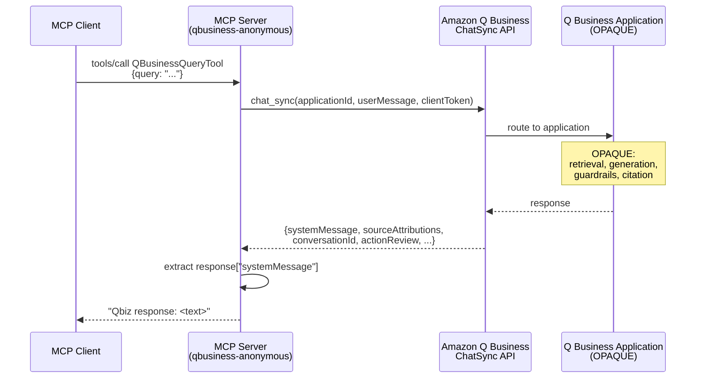
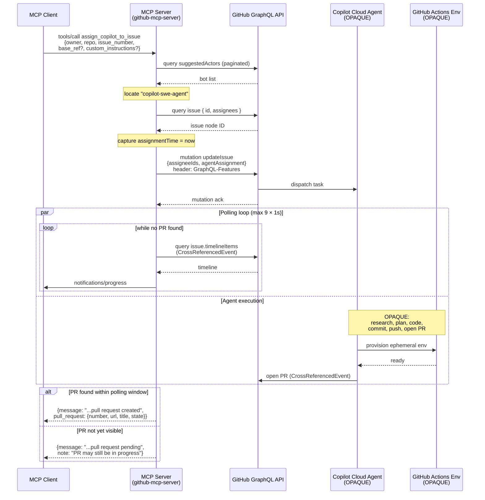

# Agent-Backed MCP Tools

Examples of how production MCP servers expose agentic backends through
`tools/call` today.

- **`QBusinessQueryTool`** from `awslabs/mcp` — synchronous wrapper around an
  Amazon Q Business application.
- **`assign_copilot_to_issue`** from `github/github-mcp-server` —
  fire-and-forget dispatch to GitHub's Copilot cloud agent, with polling for
  the resulting PR.

Both predate the MCP Tasks extension (SEP-2663). For each, this doc covers
the dispatch mechanism, information flow, and limitations.

Boundaries marked **OPAQUE** indicate components whose internals are not
publicly documented; these are treated as black boxes.

## `QBusinessQueryTool` (amazon-qbusiness-anonymous-mcp-server)

### Purpose

Query an Amazon Q Business application configured in anonymous mode and return
the generated text answer. Anonymous mode means access control on retrieved
documents is not bound to end-user identity; every caller of the application
sees the same content.

### Interface

| Field | Value |
|---|---|
| Tool name | `QBusinessQueryTool` |
| Input | `query: str` (the user's question) |
| Output | `str` of the form `"Qbiz response: <text>"` or `"Error: <message>"` |
| Required env | `AWS_REGION`, `QBUSINESS_APPLICATION_ID` |
| AWS auth | Standard boto3 credential chain (env vars, IAM role, AWS_PROFILE) |

### Behavior

The tool wraps a single boto3 call to the Amazon Q Business `ChatSync` API:

1. Validate `query` is non-empty.
2. Construct a boto3 `qbusiness` client for the configured region.
3. Call `client.chat_sync(applicationId, userMessage=query, clientToken=<random>)`.
   No `userId` or `userGroups` are passed (this is what makes the call anonymous).
4. Extract the `systemMessage` field from the response.
5. Return it as a string prefixed with `"Qbiz response: "`.

### ChatSync response fields

The full response returned by ChatSync includes the following top-level fields
(per the AWS API reference):

| Field | Description |
|---|---|
| `systemMessage` | AI-generated answer text (max 2048 chars) |
| `systemMessageId` | UUID for the assistant message |
| `userMessageId` | UUID for the user message |
| `conversationId` | UUID for the conversation; usable with subsequent ChatSync calls via `conversationId` and `parentMessageId` request fields |
| `sourceAttributions[]` | Citations: `citationNumber`, `title`, `url`, `snippet`, `documentId`, `datasourceId`, `indexId`, `textMessageSegments[]` (offset ranges into `systemMessage`) |
| `actionReview` | Present when Q Business needs the user to confirm a plugin action. Q Business plugins let the application invoke external APIs (e.g. Jira, Salesforce, ServiceNow); `actionReview` carries the proposed call for the user to approve. |
| `authChallengeRequest` | Present when a third-party plugin requires auth |
| `failedAttachments[]` | Attachment upload errors |

The MCP wrapper discards every field except `systemMessage`. Citations,
conversation continuity, action reviews, and auth challenges are not surfaced
to the MCP client.

### Chat modes (Q Business application configuration)

The Q Business application is configured with one of these modes (the MCP
server does not pass `chatMode`; the application's default applies):

- `RETRIEVAL_MODE` — answers from connected data sources only; falls back to
  LLM general knowledge if enabled
- `CREATOR_MODE` — answers from LLM general knowledge; can use attached files
- `PLUGIN_MODE` — uses configured plugins to fulfill the request

### Sequence diagram

### Opaque boundary

Everything inside the Q Business application is opaque from the MCP server's
perspective. The MCP server has no visibility into:

- Which data sources are connected
- Whether retrieval, generation, or guardrails ran
- Which model produced the response
- How citations were generated

The contract is the `ChatSync` API. What happens behind it is determined by
the application's configuration in AWS.

### Limitations

**Upstream-imposed** (constraints from Q Business itself):

- `systemMessage` is capped at 2048 characters.
- Anonymous-mode applications cannot apply per-user document ACLs; all callers
  see the same content set.

### References

- MCP server repo: <https://github.com/awslabs/mcp/tree/main/src/amazon-qbusiness-anonymous-mcp-server>
- Server entry point: <https://github.com/awslabs/mcp/blob/main/src/amazon-qbusiness-anonymous-mcp-server/awslabs/amazon_qbusiness_anonymous_mcp_server/server.py>
- Boto3 client wrapper: <https://github.com/awslabs/mcp/blob/main/src/amazon-qbusiness-anonymous-mcp-server/awslabs/amazon_qbusiness_anonymous_mcp_server/clients.py>
- AWS API: <https://docs.aws.amazon.com/amazonq/latest/api-reference/API_ChatSync.html>
- Amazon Q Business documentation: <https://docs.aws.amazon.com/amazonq/latest/qbusiness-ug/what-is.html>

---

## `assign_copilot_to_issue` (github/github-mcp-server)

### Purpose

Assign GitHub's Copilot cloud agent to a specific issue. The agent runs
autonomously in an ephemeral GitHub Actions environment, eventually opening a
pull request that addresses the issue.

### Interface

| Field | Value |
|---|---|
| Tool name | `assign_copilot_to_issue` |
| Required input | `owner: str`, `repo: str`, `issue_number: number` |
| Optional input | `base_ref: str`, `custom_instructions: str` |
| Output | JSON with `message`, `issue_number`, `issue_url`, `owner`, `repo`, optionally `pull_request: {number, url, title, state}` |
| Required scope | `repo` |
| Agent identity | `copilot-swe-agent` (GitHub bot) |

### Behavior

The tool implements the GraphQL flow for assigning the Copilot cloud agent to
an issue, then polls the issue timeline for the resulting pull request.

1. **Find the agent.** Query the repository's `suggestedActors` (capability
   `CAN_BE_ASSIGNED`), paginating until a bot with login `copilot-swe-agent` is
   found. If not found, return an error directing the user to the GitHub docs.
2. **Get IDs.** Query the issue to retrieve its node ID and existing assignees.
3. **Assign.** Call the `updateIssue` GraphQL mutation with:
   - `assigneeIds`: existing assignees + Copilot's bot ID
   - `agentAssignment`: `{targetRepositoryID, baseRef?, customInstructions?}`
   - HTTP header `GraphQL-Features: issues_copilot_assignment_api_support`
     (opts into the agent-assignment GraphQL feature, which is preview/non-GA
     and must be explicitly enabled per request)
4. **Record assignment time.** Captured before the mutation to filter out
   pre-existing PRs during polling.
5. **Poll for PR.** For up to 9 attempts at 1-second intervals (default
   `PollConfig`), query the issue's timeline for `CrossReferencedEvent` items
   from PRs authored by `copilot-swe-agent` created after the assignment time.
   Sends MCP `notifications/progress` updates during polling.
6. **Return.** If a PR is found within the polling window, return PR details.
   Otherwise return a "pull request pending" message with the issue URL.

### Sequence diagram

### Opaque boundary

The Copilot cloud agent itself is opaque from the MCP server's perspective.
The MCP server has no visibility into:

- The agent's reasoning, planning, or code generation
- The contents of the ephemeral GitHub Actions environment
- The agent's progress beyond what is observable on the issue timeline
- Any internal state the agent maintains during execution

The contract is the GraphQL `updateIssue` mutation (assign) and the issue
timeline (observe). What happens between is determined by GitHub's managed
agent service.

### Documented agent capabilities

Per the GitHub docs (cited in References), the Copilot cloud agent can:

- Research a repository
- Create implementation plans
- Fix bugs, implement features, improve test coverage
- Update documentation, address technical debt
- Resolve merge conflicts
- Iterate on its own PR when mentioned via `@copilot` in a PR comment
- Make changes within a single repository, on a single branch, in a single PR

The agent runs in an ephemeral GitHub Actions-powered environment and can
execute tests and linters.

### Limitations

**MCP-induced** (the wrapper has to work around something MCP doesn't currently
support cleanly):

- Polling window is hardcoded to 9 attempts × 1 second. MCP `tools/call` is
  request/response and practically expected to return quickly, so the wrapper
  polls briefly and returns "pending" rather than blocking for the minutes or
  hours an agent run can take. The MCP Tasks extension (SEP-2663) is the
  protocol-level fix: dispatch returns a task handle immediately, and the
  client retrieves the result via `tasks/get` whenever it's ready.

**Upstream-imposed** (constraints from the Copilot cloud agent itself):

- One repository, one branch, one PR per task.
- No mid-flight steering channel: the agent does not expose a "wait for input"
  state. Steering after dispatch is only possible by posting `@copilot`
  comments on the resulting PR.
- No cancellation API exposed by the agent. Even with MCP Tasks, the wrapper
  could not implement cancellation without an upstream signal.

### References

- MCP server repo: <https://github.com/github/github-mcp-server>
- Tool implementation: <https://github.com/github/github-mcp-server/blob/main/pkg/github/copilot.go>
- Cloud agent overview: <https://docs.github.com/en/copilot/concepts/agents/cloud-agent/about-cloud-agent>
- Assigning tasks to Copilot: <https://docs.github.com/en/copilot/using-github-copilot/using-copilot-coding-agent-to-work-on-tasks/about-assigning-tasks-to-copilot>

---

## Comparison

| Aspect | `QBusinessQueryTool` | `assign_copilot_to_issue` |
|---|---|---|
| Dispatch model | Synchronous request/response | Fire-and-forget with polling |
| Underlying API | `qbusiness:ChatSync` | GraphQL `updateIssue` + timeline polling |
| Agent identity | Q Business application | `copilot-swe-agent` GitHub bot |
| Output medium | Text response | Pull request on a branch |
| Caller can iterate | No — single-shot | Yes — via `@copilot` PR comments (separate tool) |
| Polling done by | Neither (single API call) | MCP server (9 attempts × 1s, with MCP progress notifications) |
| Opaque boundary | Q Business application | Copilot cloud agent + GitHub Actions env |
| State persisted | Conversation ID returned but ignored by wrapper | PR + branch + GitHub Actions logs |
