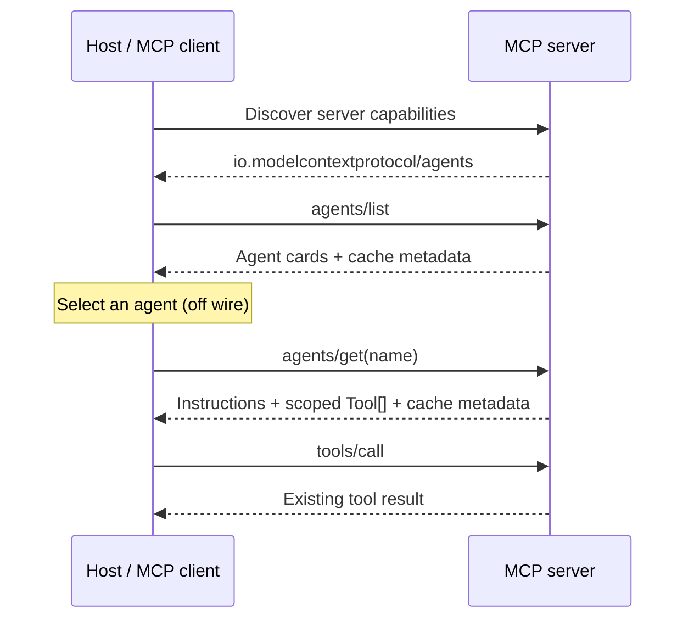

# MCP Agent Discovery Extension

- **Status**: Draft
- **Type**: Extensions Track
- **Created**: 2026-08-20
- **Author(s)**: Madhavi Pasumarthi ([@madhaviai](https://github.com/madhaviai))
- **Sponsor**: Luca Chang ([@LucaButBoring](https://github.com/LucaButBoring))
- **Associated Working Group**: MCP Agents Working Group
- **Proposed Extension Identifier**: `io.modelcontextprotocol/agents`
- **PR**: TBD

## Abstract

This proposal defines an optional MCP extension for discovering logical agents exposed by
an MCP server. It allows a host to first retrieve a small roster of agents, select the
agent that best matches the user's request, and then retrieve only the tool schemas
associated with that agent. Tool execution continues to use the existing MCP tool-calling
mechanism on the same server.

The extension addresses a scaling problem in servers that expose large and diverse tool
catalogs. Sending every tool schema to a model at connection time increases context size,
cost, latency, and the likelihood of incorrect tool selection. Agent discovery introduces
progressive disclosure: the host initially receives concise routing information and loads
detailed instructions and tool schemas only for the selected specialist.

This proposal does not turn an MCP server into an autonomous agent runtime. Agent
selection and model orchestration remain host responsibilities. The extension defines
discovery and scoped schema retrieval, using the existing MCP cache model for freshness.

## Motivation

MCP currently provides a flat tool-discovery model. This works well for small servers, but
becomes difficult to use when one server exposes tools spanning many domains, teams, or
workflows. A host may need to place every discovered tool schema in the model context even
when only a small subset is relevant to the current request.

Large flat catalogs create several practical problems:

1. **Context growth** — unrelated tool schemas consume model context and increase token
   cost.
2. **Routing ambiguity** — similar or overlapping tools make correct selection harder.
3. **Poor progressive disclosure** — hosts cannot discover a specialist first and load
   its detailed tools only when needed.
4. **Tight host configuration** — without a protocol-level grouping mechanism, each host
   must maintain its own mapping of specialists to tools.
5. **Inconsistent interoperability** — custom selector tools, resources, or private
   registries solve the problem differently and do not provide a common host behavior.

Many agent systems address this by giving a supervisor a concise roster of specialists
instead of every leaf tool. MCP can provide the same discovery benefit without defining
how agents reason, execute, retain state, or communicate. A server can describe logical
agents and their scoped tool sets while preserving the existing MCP execution model.

The desired user experience is simple: users make ordinary requests, while the host
performs discovery and routing automatically. The additional discovery steps are host
plumbing and are not exposed as actions the user must invoke.

## Goals and Direction

The immediate goal is to establish an interoperable foundation for agent-oriented
capabilities in MCP. The first version focuses on discovery and progressive disclosure:
a host receives a compact roster for routing, then retrieves detailed instructions and
tool schemas only for the selected agent. Tool execution continues through the existing
MCP tool-calling mechanism.

The design is intended to support a broader range of agent requirements over time without
forcing them into the first version. It provides a common extension namespace and
negotiation point where future, independently reviewed capabilities can evolve from
implementation experience—for example richer agent metadata, composition, delegation,
interaction patterns, and lifecycle information.

The direction is to:

- give hosts a consistent way to discover and route to agent capabilities;
- reduce context size and routing ambiguity through progressive disclosure;
- preserve interoperability across different agent frameworks and implementations;
- support cacheable discovery with clear freshness behavior;
- remain optional and backward compatible for clients and servers that do not implement
  the extension;
- create a stable foundation that can accommodate additional agent requirements without
  prematurely prescribing one orchestration architecture.

## Specification

### Extension Identifier

This extension is identified as:

```text
io.modelcontextprotocol/agents
```

### Capability Negotiation

Clients and servers explicitly declare support for the extension using the MCP extension
negotiation mechanism. Supporting the base MCP protocol does not imply support for agent
discovery.

A client declares support in its per-request capabilities:

```jsonc
{
  "params": {
    "_meta": {
      "io.modelcontextprotocol/clientCapabilities": {
        "extensions": {
          "io.modelcontextprotocol/agents": {}
        }
      }
    }
  }
}
```

A server declares support in its discovery response:

```jsonc
{
  "result": {
    "capabilities": {
      "extensions": {
        "io.modelcontextprotocol/agents": {}
      }
    }
  }
}
```

A client **MUST NOT** assume agent discovery is available unless the server advertises the
extension. A server **MUST NOT** require clients to support this extension in order to use
otherwise compatible core MCP functionality.

When the extension is not negotiated, clients and servers continue using core MCP
discovery and tool execution without agent-specific behavior.

### Agent Discovery Model

An **agent** is a server-defined logical grouping that gives a host concise routing
information and a scoped view of related MCP tools. It is not necessarily a separate
process, model, endpoint, or MCP server.

Discovery is intentionally divided into two levels:

1. **Roster** — compact agent cards used to select a relevant specialist.
2. **Details** — instructions and full tool schemas for one selected agent.

This separation is the basis of progressive disclosure. Agent cards **MUST NOT** contain
tool names or tool schemas. Capability labels are descriptive routing hints and **MUST
NOT** be treated as executable MCP tools.

The extension defines the following wire types:

```typescript
interface AgentCard {
  /** Unique identifier for this agent within the server's visible roster. */
  name: string;

  /** Optional human-readable summary of the agent's purpose. */
  description?: string;

  /** Concise routing labels; these are not MCP tool names. */
  capabilities: string[];
}

interface ListAgentsRequest extends Request {
  method: "agents/list";
  params: RequestParams;
}

interface ListAgentsResult extends CacheableResult {
  resultType: "complete";
  agents: AgentCard[];
}

interface GetAgentRequestParams extends RequestParams {
  name: string;
}

interface GetAgentRequest extends Request {
  method: "agents/get";
  params: GetAgentRequestParams;
}

interface GetAgentResult extends CacheableResult {
  resultType: "complete";

  /** Name of the agent to which these details belong. */
  agent: string;

  /** Optional guidance that a host may use when invoking this specialist. */
  instructions?: string;

  /** Existing MCP Tool objects scoped to this agent. */
  tools: Tool[];
}
```

Each agent name **MUST** be unique within the roster visible to the requesting client.
Servers **MAY** associate the same tool with more than one agent. Every returned tool
**MUST** remain callable through the existing MCP tool-calling mechanism, subject to the
same authorization context and server policy as any other tool call.

Agent membership does not grant additional authorization. A server **MUST** filter both
the roster and agent details according to the requesting client's effective permissions.

### Discovery and Invocation Flow

Agent discovery introduces two extension methods:

- `agents/list` returns the agent roster visible to the requesting client.
- `agents/get` returns instructions and scoped MCP tool schemas for one agent.

These methods provide discovery only. They do not introduce a separate agent execution
method. After choosing an agent and retrieving its details, the host invokes the returned
tools through the existing `tools/call` method on the same MCP server.

The expected flow is:

1. The client and server negotiate support for the extension.
2. The host requests the visible agent roster.
3. The host selects an agent using its name, description, and capability labels.
4. The host retrieves details for the selected agent.
5. The host makes the selected agent's instructions and tool schemas available to its
   orchestration or model layer.
6. The host invokes tools using the existing MCP tool-calling mechanism.



Agent selection occurs inside the host and is not a protocol request. The protocol does
not prescribe whether selection is performed by a model, deterministic rules, user
choice, or another routing strategy.

A host MAY represent a discovered agent as a local, non-MCP delegation tool for its
supervisor or orchestration framework. Such a tool can resolve the selected agent through
`agents/get`, construct a local specialist using the returned instructions and tool
schemas, and return a compact result to the supervisor. This is host-side orchestration;
it does not introduce an `agents/call` method or change MCP tool execution.

A host using agent-first discovery **SHOULD NOT** place the complete flat tool catalog and
the agent-scoped tool schemas into the same routing context, because doing so removes the
progressive-disclosure benefit. This does not prohibit a host from using `tools/list` for
other operational purposes.

#### Listing Agents

Clients request the roster using `agents/list`:

```jsonc
{
  "jsonrpc": "2.0",
  "id": 1,
  "method": "agents/list",
  "params": {}
}
```

The server returns compact cards only:

```jsonc
{
  "jsonrpc": "2.0",
  "id": 1,
  "result": {
    "resultType": "complete",
    "agents": [
      {
        "name": "workflow-agent",
        "description": "Investigates delivery pipelines and approvals",
        "capabilities": [
          "pipeline failures",
          "deployment readiness",
          "approval status"
        ]
      },
      {
        "name": "research-agent",
        "description": "Researches vulnerabilities and technical evidence",
        "capabilities": [
          "vulnerability research",
          "evidence collection"
        ]
      }
    ],
    "ttlMs": 60000,
    "cacheScope": "private"
  }
}
```

#### Retrieving Agent Details

After selecting an agent, the client requests its details using `agents/get`:

```jsonc
{
  "jsonrpc": "2.0",
  "id": 2,
  "method": "agents/get",
  "params": {
    "name": "workflow-agent"
  }
}
```

The response is scoped to that agent:

```jsonc
{
  "jsonrpc": "2.0",
  "id": 2,
  "result": {
    "resultType": "complete",
    "agent": "workflow-agent",
    "instructions": "Handle delivery readiness and approval workflows.",
    "tools": [
      {
        "name": "list_failed_pipelines",
        "description": "List failed pipelines for a service.",
        "inputSchema": {
          "type": "object",
          "properties": {
            "service": {
              "type": "string"
            }
          },
          "required": ["service"]
        }
      }
    ],
    "ttlMs": 60000,
    "cacheScope": "private"
  }
}
```

The returned `tools` entries use the existing MCP `Tool` type. A server **MUST NOT**
return a tool through `agents/get` if that tool is not callable by the requesting client
under the same authorization context.

#### Invoking a Tool

The client invokes a selected tool using the existing core method:

```jsonc
{
  "jsonrpc": "2.0",
  "id": 3,
  "method": "tools/call",
  "params": {
    "name": "list_failed_pipelines",
    "arguments": {
      "service": "payments"
    }
  }
}
```

Tool call request and response semantics are unchanged by this extension. The server
dispatches the call through its existing tool implementation; the agent grouping provides
discovery scope and does not create an additional execution layer.

### Caching and Freshness

Both `agents/list` and `agents/get` results follow the MCP `CacheableResult` model defined
by [SEP-2549](https://github.com/modelcontextprotocol/modelcontextprotocol/blob/main/seps/2549-TTL-for-list-results.md).
Their results include:

- `ttlMs`: the number of milliseconds for which the client may reuse the response;
- `cacheScope`: whether the response is safe for a shared cache (`public`) or restricted
  to the requesting authorization context (`private`).

A `ttlMs` value of `0` means the result is immediately stale. Servers **MUST NOT** return
a negative value.

Clients **MAY** cache the roster and agent details. A client that caches these results
follows the standard MCP cache-scope semantics. An `agents/get` entry is cached separately
for each agent name.

Servers **SHOULD** use `private` unless they can guarantee that the response is identical
and safe for every client. This is especially important when agent visibility, agent
instructions, or tool availability depends on authorization.

Roster and detail results are cached independently. The TTL of an agent's details does
not extend the TTL of the roster, and the roster TTL does not extend the TTL of any
previously retrieved details.

When a cached result expires, a host **SHOULD** refresh it before using its contents to
prepare a new agent-routed tool call. Expiry does not cancel or otherwise change the
semantics of a `tools/call` request that is already in progress.

The TTL applies to agent discovery only. It is not a per-tool TTL, does not alter the
retention semantics of the Tasks extension, and does not cancel in-flight tool calls.

## Open Design Questions

The initial proposal intentionally leaves the following questions open for Agents Working
Group review:

1. **Change notifications** — Is TTL-based refresh sufficient for the first version, or
   should the extension define an agent-list-changed event? If so, should it use
   `subscriptions/listen`, and which cached results should a client invalidate?
2. **Pagination** — Does the compact roster need cursor-based pagination in the first
   version, or can pagination be added after implementation experience?
3. **Error handling** — Which existing MCP/JSON-RPC errors should apply to an unknown
   agent, invalid agent request, missing extension support, or an agent definition that
   references unavailable tools? Does agent discovery require any dedicated extension
   error code?

## Rationale

### Two-Level Discovery

Returning agent cards separately from tool schemas keeps the first routing context small.
If `agents/list` returned every tool schema, hosts would receive nearly the same payload as
flat tool discovery and the extension would not provide meaningful progressive
disclosure.

`agents/get` forms the second level because a host needs complete MCP `Tool` definitions
before it can expose or invoke the selected tools. This preserves MCP's existing schema
and execution model rather than introducing a second representation of tools.

### Host-Side Selection

Agent selection remains inside the host. MCP servers are not required to run a supervisor
model, choose an agent on behalf of the host, or expose a particular orchestration
framework. This allows deterministic routers, model-based routers, user selection, and
other approaches to use the same discovery protocol.

### Same-Server Tool Execution

The selected tool is called on the same MCP server through `tools/call`. This avoids
requiring one deployment, connection, authentication flow, or transport hop per logical
agent. It also preserves existing tool handlers, middleware, authorization, and result
semantics.

### Alternatives Considered

**Flat tool discovery.** Existing `tools/list` remains suitable for smaller catalogs, but
does not provide a compact specialist roster or progressive schema loading for larger
servers.

**Resources as agent cards.** A resource can describe an agent, but it does not establish
a standard relationship between that description and a bounded set of callable tools.
Hosts may still load both the resource and the full tool catalog.

**Selector or mega-tools.** A server can expose one tool that privately routes to internal
agents or APIs. This reduces the visible tool catalog, but hides specialist tool schemas
and makes composition, authorization, and interoperability dependent on a custom tool
contract.

**One MCP server per agent.** Separate servers provide strong deployment isolation, but
require hosts to discover and connect to multiple servers and to construct an agent roster
outside MCP. The proposal supports logical agents within one server without preventing
deployments that choose stronger isolation.

**Skills or server cards.** Skills and server metadata can provide useful instructions or
descriptions, but do not by themselves progressively disclose a selected subset of MCP
tool schemas.

## Backward Compatibility

This extension is additive and optional.

Clients that do not advertise the extension continue to use core MCP discovery and tool
execution. Servers that do not advertise the extension require no changes. A server that
supports agent discovery continues to expose and execute its tools using existing MCP
tool semantics.

The extension does not change the request or response shape of `tools/list` or
`tools/call`. It adds discovery methods that are used only after client and server support
has been negotiated.

If extension negotiation does not succeed, no agent-specific method is assumed to be
available. Existing clients and servers therefore remain interoperable without
understanding agent cards or agent details.

## Security Implications

Agent discovery can reveal information about server capabilities, internal workflows, and
available tools. Servers **MUST NOT** use an agent card or agent membership to grant
permissions that the requesting client does not otherwise possess.

The tools returned for an agent remain subject to the server's existing authentication,
authorization, and policy enforcement when invoked. Discovering a tool through
`agents/get` does not guarantee that a later call will be authorized, because policy or
request context may change.

Servers should avoid exposing sensitive operational details in agent descriptions,
capability labels, or instructions. When discovery differs by user, tenant, or
authorization context, servers should use private cache scope and ensure responses are not
shared across those boundaries.

Agent instructions and metadata are server-provided content. Hosts should apply the same
trust and safety treatment they use for tool descriptions and other server-provided
instructions; discovery metadata must not override host security policy or user consent.

## Reference Implementation

An updated draft implementation is maintained in a fork of the MCP Python SDK:

- [Python SDK agent discovery branch](https://github.com/madhaviai/python-sdk/tree/feat/mcp-agents-exp)
- Original [prototype commit](https://github.com/madhaviai/python-sdk/commit/ff1f5ac1f4f31818c909d70eabf6836ebf438f22)

The updated implementation demonstrates:

- formal extension advertisement using `io.modelcontextprotocol/agents`;
- per-request client extension declaration and server-side enforcement;
- shared agent wire contracts used by both client and server;
- server-side agent registration and management;
- compact roster discovery and scoped agent details;
- client session methods for both discovery steps;
- result-level `ttlMs` and `cacheScope`;
- execution through the existing `tools/call` path;
- basic error handling for unknown agents and missing tool references;
- tests covering extension negotiation, wire serialization, discovery, scoping, and
  tool execution.

For error handling, the implementation currently uses `-32602` (Invalid params) for both an
unknown agent and an agent definition that references unavailable tools. The Working
Group still needs to agree on the extension's error contract before this behavior is
treated as normative.

Pagination and agent-change notifications are intentionally not implemented while those
behaviors remain open design questions. If change notifications are added, they should
integrate with `subscriptions/listen` rather than introduce a separate delivery mechanism.

A runnable example and setup instructions are available with the supporting research:

- [Research PR #20](https://github.com/modelcontextprotocol/agents-wg/pull/20)
- [Runnable example](https://github.com/madhaviai/agents-wg/blob/deep-agents-vs-mcp-agents/docs/research/examples/README.md)

The reference implementation tracks the current draft and will continue to change as the
Working Group reviews the wire shape. Features that remain open, such as notifications or
pagination, will be implemented only if they are included in the reviewed extension
design.

## Future Direction

This first proposal establishes discovery and progressive disclosure. Future proposals
may build on implementation experience to explore richer metadata, composition,
delegation, interaction patterns, or lifecycle information. Those capabilities are not
defined by this initial wire shape and require separate review.

## References

- [MCP SEP Guidelines](https://modelcontextprotocol.io/community/sep-guidelines)
- [MCP Extensions Overview](https://modelcontextprotocol.io/extensions/overview)
- [SEP-2133: Extensions](https://modelcontextprotocol.io/seps/2133-extensions)
- [SEP-2549: TTL for List Results](https://github.com/modelcontextprotocol/modelcontextprotocol/blob/main/seps/2549-TTL-for-list-results.md)
- [MCP Tools](https://modelcontextprotocol.io/specification/draft/server/tools)
- [Agent workflow comparison and MCP agent capabilities](https://github.com/modelcontextprotocol/agents-wg/pull/20)

