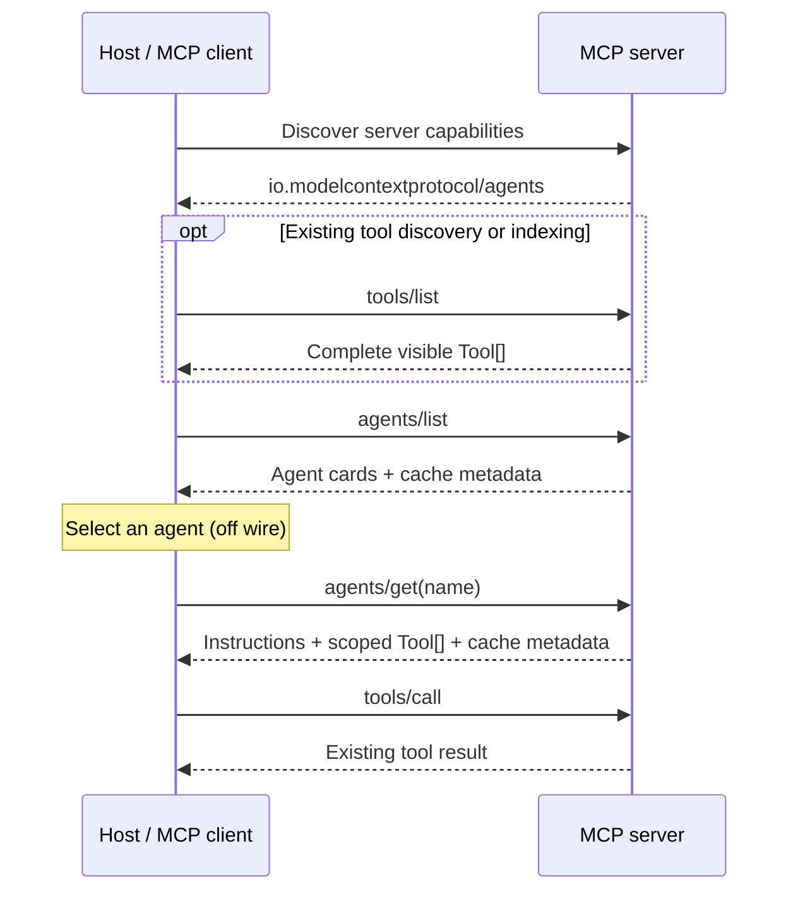

# MCP Agent Discovery Extension

- **Status**: Draft
- **Type**: Extensions Track
- **Created**: 2026-08-20
- **Author(s)**: Madhavi Pasumarthi ([@madhaviai](https://github.com/madhaviai))
- **Sponsor**: Luca Chang ([@LucaButBoring](https://github.com/LucaButBoring))
- **Associated Working Group**: MCP Agents Working Group
- **Proposed Extension Identifier**: `io.modelcontextprotocol/agents`
- **PR**: TBD

## Abstract

This proposal defines an optional MCP extension for discovering logical agents exposed by
an MCP server. It allows a host to first retrieve a small roster of agents, select the
agent that best matches the user's request, and then retrieve only the tool schemas
associated with that agent. Tool execution continues to use the existing MCP tool-calling
mechanism on the same server.

The extension addresses a scaling problem in servers that expose large and diverse tool
catalogs. Sending every tool schema to a model at connection time increases context size,
cost, latency, and the likelihood of incorrect tool selection. Agent discovery introduces
progressive disclosure: the host initially receives concise routing information and loads
detailed instructions and tool schemas only for the selected agent.

This proposal does not turn an MCP server into an autonomous agent runtime. Agent
selection and model orchestration remain host responsibilities. The extension defines
discovery and scoped schema retrieval, using the existing MCP cache model for freshness.

## Motivation

MCP currently provides a flat tool-discovery model. This works well for small servers, but
becomes difficult to use when one server exposes tools spanning many domains, teams, or
workflows. A host may need to place every discovered tool schema in the model context even
when only a small subset is relevant to the current request.

Large flat catalogs create several practical problems:

1. **Context growth** — unrelated tool schemas consume model context and increase token
   cost.
2. **Routing ambiguity** — similar or overlapping tools make correct selection harder.
3. **Poor progressive disclosure** — hosts cannot discover an agent first and load
   its detailed tools only when needed.
4. **Tight host configuration** — without a protocol-level grouping mechanism, each host
   must maintain its own mapping of agents to tools.
5. **Inconsistent interoperability** — custom selector tools, resources, or private
   registries solve the problem differently and do not provide a common host behavior.

Many agent frameworks already support supervisor-subagent orchestration in some form.
Examples include Deep Agents subagents, LangGraph supervisor patterns, Google ADK
sub-agent hierarchies, OpenAI Agents SDK handoffs and agents-as-tools, and Microsoft Agent
Framework orchestration patterns. In these systems, a supervisor delegates a work item to
a selected subagent, and that subagent uses a bounded tool set to decide which tools to
call. Flat tool discovery instead commonly requires the supervisor to route directly
across every exposed tool schema.

This extension plugs into existing host orchestration by discovering a concise agent
roster first and retrieving tool schemas only for the selected agent. This reduces the
schemas and tokens loaded into the supervisor's context while preserving `tools/call` for
execution; delegation and agent execution remain host responsibilities.

The desired user experience is simple: users make ordinary requests, while the host
performs discovery and routing automatically. The additional discovery steps are host
plumbing and are not exposed as actions the user must invoke.

This extension addresses an immediate use case: populating existing host-side subagent
registries from MCP servers. A host can discover a compact roster, select an agent,
retrieve its instructions and scoped tool schemas, and execute those tools through the
existing MCP tool-calling mechanism without requiring additional agent capabilities.

The discovery model can also provide a foundation for future, independently reviewed
capabilities informed by implementation experience, such as richer agent metadata,
composition, delegation, interaction patterns, or lifecycle information.

## Specification

### Extension Identifier

This extension is identified as:

```text
io.modelcontextprotocol/agents
```

### Capability Negotiation

Clients and servers explicitly declare support for the extension using the MCP extension
negotiation mechanism.

A client declares support in its per-request capabilities:

```jsonc
{
  "params": {
    "_meta": {
      "io.modelcontextprotocol/clientCapabilities": {
        "extensions": {
          "io.modelcontextprotocol/agents": {}
        }
      }
    }
  }
}
```

A server declares support in its discovery response:

```jsonc
{
  "result": {
    "capabilities": {
      "extensions": {
        "io.modelcontextprotocol/agents": {
          "listChanged": true
        }
      }
    }
  }
}
```

The optional `listChanged` setting indicates that the server supports agent-roster change
notifications. Omitting it or setting it to `false` indicates that such notifications are
not supported.

A client **MUST NOT** assume agent discovery is available unless the server advertises the
extension. A server **MUST NOT** require clients to support this extension in order to use
otherwise compatible core MCP functionality.

When the extension is not negotiated, clients and servers continue using core MCP
discovery and tool execution without agent-specific behavior.

### Agent Discovery Model

An **agent** is a server-defined logical grouping that gives a host concise routing
information and a scoped view of related MCP tools. It is not necessarily a separate
process, model, endpoint, or MCP server.

Discovery is intentionally divided into two levels:

1. **Roster** — compact agent cards used to select a relevant agent.
2. **Details** — instructions and full tool schemas for one selected agent.

This separation is the basis of progressive disclosure. Capability labels are descriptive
routing hints; clients do not interpret them as references to executable MCP tools.

The extension defines the following wire types:

```typescript
interface AgentCard {
  /** Unique identifier for this agent within the server's visible roster. */
  name: string;

  /** Optional human-readable summary of the agent's purpose. */
  description?: string;

  /** Concise routing labels; these are not MCP tool names. */
  capabilities: string[];
}

interface ListAgentsRequest extends PaginatedRequest {
  method: "agents/list";
  params: PaginatedRequestParams;
}

interface ListAgentsResult extends PaginatedResult, CacheableResult {
  resultType: "complete";
  agents: AgentCard[];
}

interface GetAgentRequestParams extends RequestParams {
  name: string;
}

interface GetAgentRequest extends Request {
  method: "agents/get";
  params: GetAgentRequestParams;
}

interface GetAgentResult extends CacheableResult {
  resultType: "complete";

  /** Name of the agent to which these details belong. */
  agent: string;

  /** Optional guidance that a host may use when invoking this agent. */
  instructions?: string;

  /** Existing MCP Tool objects scoped to this agent. */
  tools: Tool[];
}

interface AgentListChangedNotification extends Notification {
  method: "notifications/agents/list_changed";
  params?: NotificationParams;
}
```

Each agent name **MUST** be unique within the roster visible to the requesting client.
Servers **MAY** associate the same tool with more than one agent. Tool names are
server-scoped; this extension does not create agent-local tool namespaces. If the
same tool name appears under multiple agents, it **MUST** identify the same server-wide
callable tool. Every returned tool **MUST** also be discoverable through `tools/list` and
remain callable through the existing MCP tool-calling mechanism, subject to the same
authorization context and server policy as any other tool call.
When `tools/list` and `agents/get` responses are produced from the same server state and
authorization context, all fields of the corresponding `Tool` definitions **MUST** match.

Agent membership does not grant additional authorization. A server **MUST** filter both
the roster and agent details according to the requesting client's effective permissions.

### Discovery and Invocation Flow

Agent discovery introduces two extension methods:

- `agents/list` returns the agent roster visible to the requesting client.
- `agents/get` returns instructions and scoped MCP tool schemas for one agent.

These methods provide discovery only. They do not introduce a separate agent execution
method. After choosing an agent and retrieving its details, the host invokes the returned
tools through the existing `tools/call` method on the same MCP server.

The expected flow is:

1. The client and server negotiate support for the extension.
2. The host **MAY** request the complete visible tool catalog through `tools/list` for
   existing discovery, indexing, or SDK operation.
3. The host requests the visible agent roster.
4. The host selects an agent using its name, description, and capability labels.
5. The host retrieves details for the selected agent.
6. The host makes the selected agent's instructions and tool schemas available to its
   orchestration or model layer.
7. The host invokes tools using the existing MCP tool-calling mechanism.



This extension does not change `tools/list` semantics. A server **MUST NOT** omit a tool
from `tools/list` solely because that tool is associated with one or more agents.

Agent selection occurs inside the host and is not a protocol request. The protocol does
not prescribe whether selection is performed by a model, deterministic rules, user
choice, or another routing strategy.

A host MAY represent a discovered agent as a local, non-MCP delegation tool for its
supervisor or orchestration framework. Such a tool can resolve the selected agent through
`agents/get`, construct a local agent using the returned instructions and tool
schemas, and return a compact result to the supervisor. This is host-side orchestration;
it does not introduce an `agents/call` method or change MCP tool execution.

A host using agent-first discovery **SHOULD NOT** place the complete flat tool catalog and
the agent-scoped tool schemas into the same routing context, because doing so removes the
progressive-disclosure benefit. This does not prohibit a host from using `tools/list` for
other operational purposes. Existing systems that already call `tools/list` **MAY** retain
that behavior for indexing, schema validation, and other host operations. Progressive
disclosure concerns which tool schemas the host presents to the model's routing context,
not whether the host requests or stores the complete catalog.

#### Listing Agents

Clients request the roster using `agents/list`:

```jsonc
{
  "jsonrpc": "2.0",
  "id": 1,
  "method": "agents/list",
  "params": {
    "cursor": "optional-cursor-value"
  }
}
```

The server returns compact cards only:

```jsonc
{
  "jsonrpc": "2.0",
  "id": 1,
  "result": {
    "resultType": "complete",
    "agents": [
      {
        "name": "workflow-agent",
        "description": "Investigates delivery pipelines and approvals",
        "capabilities": [
          "pipeline failures",
          "deployment readiness",
          "approval status"
        ]
      },
      {
        "name": "research-agent",
        "description": "Researches vulnerabilities and technical evidence",
        "capabilities": [
          "vulnerability research",
          "evidence collection"
        ]
      }
    ],
    "nextCursor": "next-page-cursor",
    "ttlMs": 60000,
    "cacheScope": "private"
  }
}
```

`agents/list` uses the standard MCP pagination model. Clients omit `cursor` for the first
page and continue with the returned `nextCursor` until the response omits it.

#### Agent Roster Changes

A server that advertises `listChanged: true` for this extension supports
`notifications/agents/list_changed`. Clients opt in by adding `agentsListChanged: true` to
the `notifications` filter of a `subscriptions/listen` request. The server acknowledges
and delivers the notification using the standard MCP subscription mechanism.

The notification indicates that the visible roster or one or more agent cards may have
changed. A client receiving it **SHOULD** invalidate all cached `agents/list` pages and
re-list before making a new routing decision. After re-listing, it **SHOULD** discard
cached `agents/get` results for agents that are no longer visible.

#### Retrieving Agent Details

After selecting an agent, the client requests its details using `agents/get`:

```jsonc
{
  "jsonrpc": "2.0",
  "id": 2,
  "method": "agents/get",
  "params": {
    "name": "workflow-agent"
  }
}
```

The response is scoped to that agent:

```jsonc
{
  "jsonrpc": "2.0",
  "id": 2,
  "result": {
    "resultType": "complete",
    "agent": "workflow-agent",
    "instructions": "Handle delivery readiness and approval workflows.",
    "tools": [
      {
        "name": "list_failed_pipelines",
        "description": "List failed pipelines for a service.",
        "inputSchema": {
          "type": "object",
          "properties": {
            "service": {
              "type": "string"
            }
          },
          "required": ["service"]
        }
      }
    ],
    "ttlMs": 60000,
    "cacheScope": "private"
  }
}
```

Tool call request and response semantics are unchanged by this extension. The server
dispatches the call through its existing tool implementation; the agent grouping provides
discovery scope and does not create an additional execution layer.

### Caching and Freshness

Both `agents/list` and `agents/get` results follow the MCP `CacheableResult` model defined
by [SEP-2549](https://github.com/modelcontextprotocol/modelcontextprotocol/blob/main/seps/2549-TTL-for-list-results.md).

The roster is one cache entry, and each `agents/get` result is a separate entry keyed by
agent name.

For both `agents/list` and `agents/get`, servers **SHOULD** use `private` unless they can
guarantee that the particular response is identical and safe for every client. This is
especially important when agent visibility, agent instructions, or tool availability
depends on authorization.

The TTL of an agent's details does not extend the roster TTL, and the roster TTL does not
extend any previously retrieved details. These TTLs apply only to discovery results; they
do not alter Tasks retention or cancel in-flight tool calls.

### Error Handling

Agent discovery uses existing JSON-RPC error codes with a stable `reason` discriminator in
the error `data` object:

- If the requested agent does not exist or is not visible to the requesting client, the
  server **MUST** return `-32602` (`Invalid params`) with
  `data.reason: "agent_not_found"`. Clients **MAY** refresh `agents/list` and retry.
- If an agent definition references a tool that is unavailable under the same server
  configuration, the server **MUST** return `-32603` (`Internal error`) with
  `data.reason: "invalid_agent_definition"`. Clients **SHOULD NOT** retry until the server
  configuration changes.

Servers **MUST NOT** distinguish a nonexistent agent from an agent hidden by authorization,
because doing so could disclose the existence of an inaccessible agent.

## Rationale

### Two-Level Discovery

Returning agent cards separately from tool schemas keeps the first routing context small.
If `agents/list` returned every tool schema, hosts would receive nearly the same payload as
flat tool discovery and the extension would not provide meaningful progressive
disclosure.

`agents/get` forms the second level because a host needs complete MCP `Tool` definitions
before it can expose or invoke the selected tools. Returning only tool names would require
an agent-first host to fetch the complete `tools/list` catalog and reconstruct agent
membership locally. Returning the selected definitions directly keeps `agents/get`
self-contained, avoids transferring unrelated schemas when `tools/list` is not otherwise
needed, and leaves the server authoritative for authorization-scoped agent membership.
The definitions still use the existing MCP `Tool` type and must remain consistent with
their `tools/list` counterparts, preserving MCP's existing schema and execution model.

### Host-Side Selection

Agent selection remains inside the host. MCP servers are not required to run a supervisor
model, choose an agent on behalf of the host, or expose a particular orchestration
framework. This allows deterministic routers, model-based routers, user selection, and
other approaches to use the same discovery protocol.

### Same-Server Tool Execution

Selected tools are invoked through the existing `tools/call` method, preserving MCP tool
handlers, middleware, authorization, and result semantics. Agent grouping remains a
discovery concern and does not require servers to adopt a particular runtime, process, or
internal orchestration architecture.

### Alternatives Considered

**Flat tool discovery.** Existing `tools/list` remains suitable for smaller catalogs, but
does not provide a compact agent roster or progressive schema loading for larger
servers.

**Resources as agent cards.** A specialized resource format could carry agent metadata
and its relationship to a bounded set of tools. However, it would appear through ordinary
resource discovery and could be presented as normal content by clients that do not
support agent discovery. Unless it duplicated complete tool definitions, hosts would
still need to join it with `tools/list`. Dedicated, capability-gated methods provide typed
agent semantics without overloading the resource model.

**Selector or mega-tools.** A server can expose one tool that privately routes to internal
agents or APIs. This reduces the visible tool catalog, but hides agent tool schemas
and makes composition, authorization, and interoperability dependent on a custom tool
contract.

**One MCP server per agent.** Separate servers provide strong deployment isolation, but
require hosts to discover and connect to multiple servers and to construct an agent roster
outside MCP. The proposal supports logical agents within one server without preventing
deployments that choose stronger isolation.

**Skills or server cards.** These formats could be extended to include agent metadata and
tool relationships. However, server cards describe a server as a whole, while skills
primarily package reusable instructions or knowledge. Agent discovery represents multiple
dynamic, authorization-scoped tool groupings with independent listing, retrieval, caching,
and change behavior. Adding those semantics to skills or server cards would couple
distinct abstractions and effectively recreate dedicated agent-discovery operations
within them.

## Backward Compatibility

This extension is additive and optional.

Clients that do not advertise the extension continue to use core MCP discovery and tool
execution. Servers that do not advertise the extension require no changes. A server that
supports agent discovery continues to expose and execute its tools using existing MCP
tool semantics.

The extension does not change the request or response shape of `tools/list` or
`tools/call`. It adds discovery methods that are used only after client and server support
has been negotiated.

If extension negotiation does not succeed, no agent-specific method is assumed to be
available. Existing clients and servers therefore remain interoperable without
understanding agent cards or agent details.

## Security Implications

Agent discovery can reveal information about server capabilities, internal workflows, and
available tools. Servers **MUST NOT** use an agent card or agent membership to grant
permissions that the requesting client does not otherwise possess.

The tools returned for an agent remain subject to the server's existing authentication,
authorization, and policy enforcement when invoked. Discovering a tool through
`agents/get` does not guarantee that a later call will be authorized, because policy or
request context may change.

Servers should avoid exposing sensitive operational details in agent descriptions,
capability labels, or instructions. When discovery differs by user, tenant, or
authorization context, servers should use private cache scope and ensure responses are not
shared across those boundaries.

Agent instructions and metadata are server-provided content. Hosts should apply the same
trust and safety treatment they use for tool descriptions and other server-provided
instructions; discovery metadata must not override host security policy or user consent.

## Reference Implementation

An updated draft implementation is maintained in a fork of the MCP Python SDK:

- [Python SDK agent discovery branch](https://github.com/madhaviai/python-sdk/tree/feat/mcp-agents-exp)
- Original [prototype commit](https://github.com/madhaviai/python-sdk/commit/ff1f5ac1f4f31818c909d70eabf6836ebf438f22)

The updated implementation demonstrates:

- formal extension advertisement using `io.modelcontextprotocol/agents`;
- per-request client extension declaration and server-side enforcement;
- shared agent wire contracts used by both client and server;
- server-side agent registration and management;
- compact roster discovery and scoped agent details;
- client session methods for both discovery steps;
- result-level `ttlMs` and `cacheScope`;
- execution through the existing `tools/call` path;
- basic error handling for unknown agents and missing tool references;
- tests covering extension negotiation, wire serialization, discovery, scoping, and
  tool execution.

The implementation currently uses `-32602` (`Invalid params`) for both an unknown agent
and an agent definition that references unavailable tools. It does not yet implement the
pagination, notification, or distinguishable error behavior specified above.

A runnable example and setup instructions are available with the supporting research:

- [Research PR #20](https://github.com/modelcontextprotocol/agents-wg/pull/20)
- [Runnable example](https://github.com/madhaviai/agents-wg/blob/deep-agents-vs-mcp-agents/docs/research/examples/README.md)

The reference implementation tracks the current draft and will continue to change as the
Working Group reviews the wire shape.

## Future Direction

This proposal establishes discovery and progressive disclosure. Future proposals
may build on implementation experience to explore richer metadata, composition,
delegation, interaction patterns, or lifecycle information. Those capabilities are not
defined by this wire shape and require separate review.

## References

- [MCP SEP Guidelines](https://modelcontextprotocol.io/community/sep-guidelines)
- [MCP Extensions Overview](https://modelcontextprotocol.io/extensions/overview)
- [SEP-2133: Extensions](https://modelcontextprotocol.io/seps/2133-extensions)
- [SEP-2549: TTL for List Results](https://github.com/modelcontextprotocol/modelcontextprotocol/blob/main/seps/2549-TTL-for-list-results.md)
- [MCP Tools](https://modelcontextprotocol.io/specification/draft/server/tools)
- [Agent workflow comparison and MCP agent capabilities](https://github.com/modelcontextprotocol/agents-wg/pull/20)

